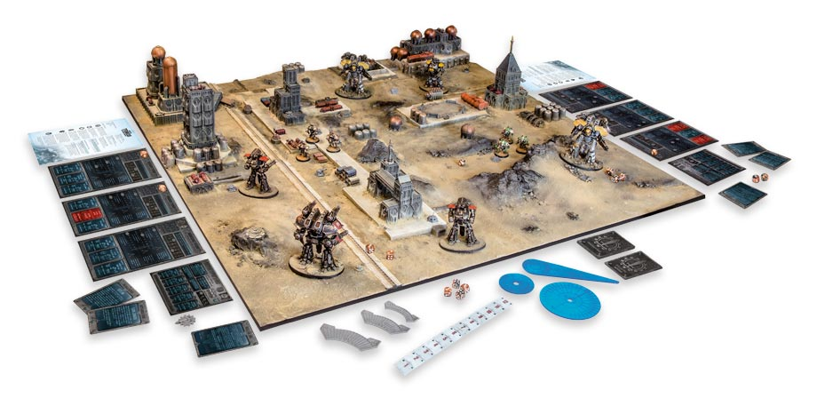

# Playing Adeptus Titanicus

Before reading through the rules, it might be helpful to look over these pages to get an idea of how a game is set up.

**1. The Battlefield**

Any flat area can become a suitable battlefield with a little work. An area that is 2'×4' is the smallest size that will make for an interesting battle between two Titans, but most of the battles in this book are based around a 4'×4' battlefield.

**2. Terrain**

Adeptus Titanicus can be played without any terrain, but battles are much more interesting when the battlefield is more than a barren wasteland. The modular plastic buildings produced as part of the Adeptus Titanicus range are an ideal place to start, but many players may be inspired to build their own impressive gaming tables, like the one shown in the photo.

**3. Models**

Each player will need a set of models to represent their Titans. Here, two average-sized forces are engaged in battle, but the Titanic Clash scenario on page 40 (which has been designed for new players) can be played with as little as one Titan per player.

**4. Dice**

Adeptus Titanicus uses a range of different dice, as detailed on page 24.

**5. Command Terminals and Status Markers**

Each Titan requires its own Command Terminal, which is used to track its status during the game. These should be kept to one side, near the battlefield, and should be laid out so that they do not overlap and can be seen at all times. See page 27 for more information about Command Terminals.

**6. The Opus Titanica**

The Opus Titanica emblem is used to show who is the First Player in each round, as described on page 22.

**7. Blast Markers and Flame Template**

These markers represent massive explosions, energy blasts or gouts of flame, and are used with weapons that have the Blast or Firestorm traits, as seen on pages 38 and 39.

**8. Status Markers**

Status markers are used on Command Terminals to track a number of different things (see page 27). There are two designs of Status marker; for now they can be used interchangeably, but future supplements may add rules that differentiate between them.

**9. Arc Templates**

Arc templates are used to determine a Titan's firing arcs, as detailed on page 26.

**10. Range Ruler**

A 12" range ruler is included with the game, but for measuring longer distances it may be useful to upgrade to a tape measure marked in inches.

**11. Battlefield Assets**

The box contains six Battlefield Assets - these are part of the rules for Stratagems, and are explained on page 65.

**12. Designation Markers**

These double-sided markers sit on a player's Command Terminals, giving each terminal a unique number as a reminder of which Titan it corresponds with.

**13. Weapon Cards**

Each Command Terminal is overlaid with cards representing the Titan's weapons. These cards are double-sided - when the weapon is disabled, the card is flipped. See page 38 for more information about weapons.

**14. Reference Sheets**

Each player has a reference sheet featuring the most commonly used rules and tables so that they do not have to look them up in the rulebook mid-game.

**15. Mission and Stratagem Cards**

Mission cards are used with the Matched Play rules (see page 84), and Stratagems (see page 64) give players access to battlefield support, devious tricks and certain other methods of evening out the odds. As both of these are part of the Advanced Rules, new players should set these cards aside until they have played some basic games.

**(Optional) Pen and Paper**

Players will find it useful to have a pen and paper at hand, as certain scenarios and stratagems will require them to make notes (sometimes in secret!) and refer to them later.
