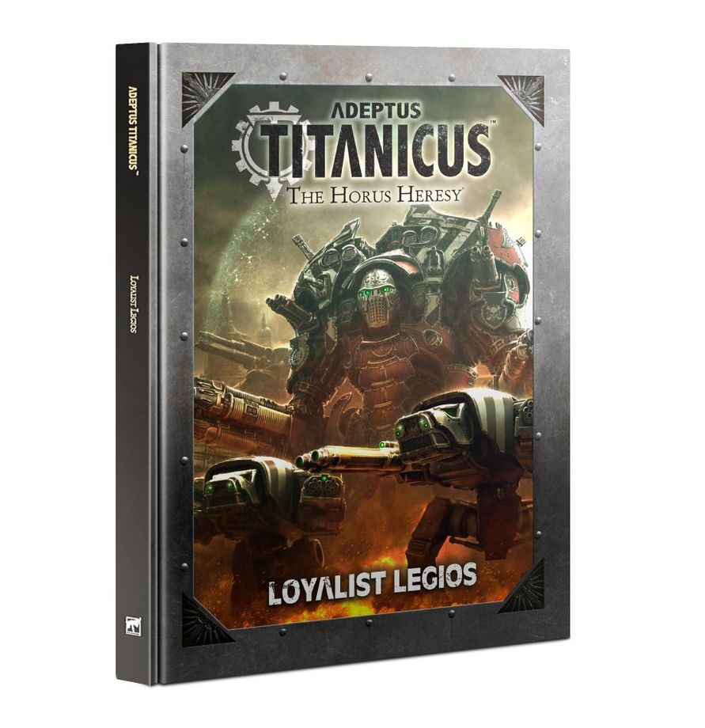

Adeptus Titanicus:

Loyalist Legios

"We stand upon a precipice, the dawn of a new age our forebears long feared would come. Hold no longer to hope and idealism. Let naught but wrath sustain you. Let justice be your creed. The galaxy must be cleansed of the traitorous plague that befalls it and we, sons of Ryza, are the fire that will scour it clean of disease."

Transcribed speech given by Grand Master Grunal Krom of Legio Crucius, following the Second Battle for Conveyance Terminus Nine-Omega on Ryza

The majesty of the Titan Legions is at once both that of noble bearing and terrible might. When the Warmaster turned against the Emperor of Mankind, dragging the Imperium into civil war, the Collegia Titanica, ruling body of the Titan Legions, was not spared disunity. Across the galaxy, Titan Legion turned upon Titan Legion, and the galaxy quaked beneath their tread. The war that followed proved beyond any Mankind had fought, and innumerable worlds were burned to ash beneath the wrath of warring god-engines. Many Titan Legions remained loyal to the Emperor and, from the basalt sands of Isstvan V to the walls of the Imperial Palace itself, all sought to turn back the Warmaster and bring stability to the Imperium once more.

This supplement for Adeptus Titanicus contains everything you need to field a Titan Legion or Knight Household loyal to the Emperor. Within you'll find rules for assembling a battlegroup dedicated to the Imperium of Mankind along with the unique weapons and wargear available to such a force. Adeptus Titanicus: Loyalist Legios also provides rules for 16 famous Titan Legions that remained loyal to the Emperor, including the lauded Legio Metalica (Iron Skulls) and the ruthless Legio Osedax (Cockatrices), along with rules for fielding them on the battlefield. Adeptus Titanicus: Loyalist Legios also contains rules for 12 Loyalist Knight Houses including House Terryn, House Coldshroud, House Krast and House Procon Vi. In addition, this book contains rules for 18 Titan maniples, the Psi-Titans of the Ordo Sinister, weapon reference charts and every Stratagem available to Loyalist battlegroups.

