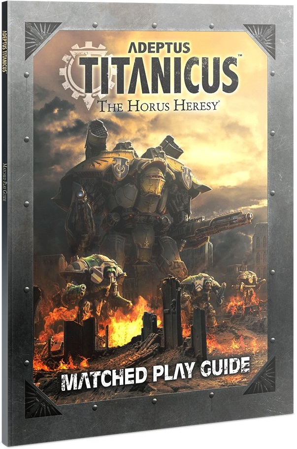

# Adeptus Titanicus Matched Play Guide

This supplement offers guidelines and advice for organising, setting up and running your own Adeptus Titanicus events, whether that is tournaments and gaming weekends, or events held at your local gaming club. The aim of this book is to provide a codified set of rules and suggestions that enable both players and Tournament Organisers to tailor their games as they see fit. It is designed as a primer for running Adeptus Titanicus events and is intended to work alongside other methods of play, such as Narrative Play or Open Play, to offer a new gaming experience for all players.

Within you'll find advice for running "Organised Play" events, including rules for building battlegroups, and new objectives and Deployment Maps, which represent the standard rules for running competitive "Matched Play" style events or games; these significantly expand upon the Matched Play rules presented in the *Adeptus Titanicus* rulebook. Alongside this, the book offers suggestions and tips for running your own events, whether that is Organised Play, Doubles, or Narrative events.

