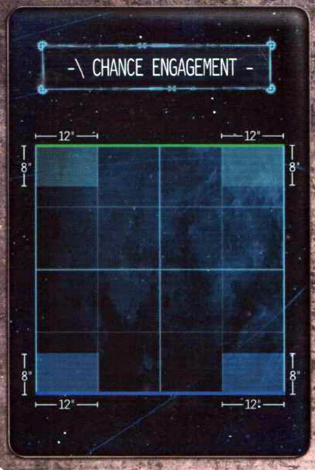
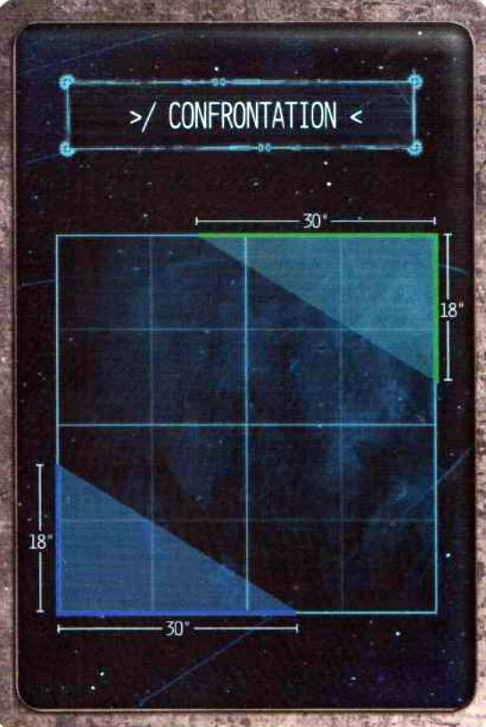
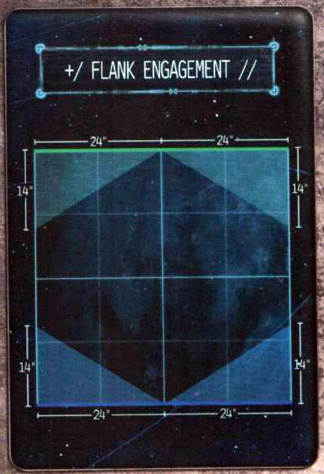
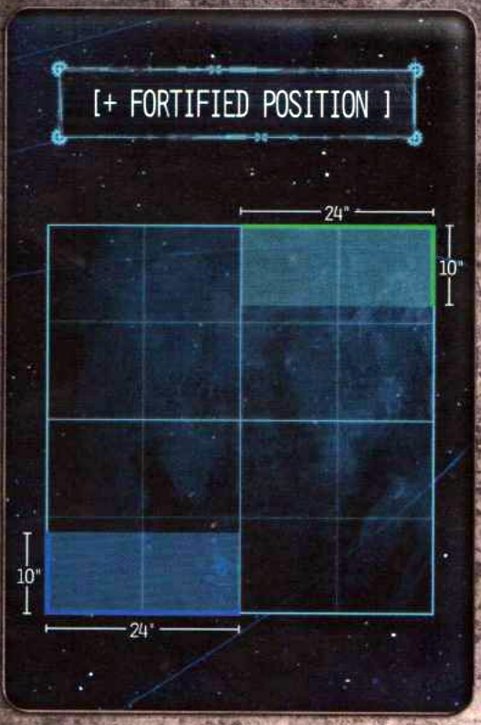
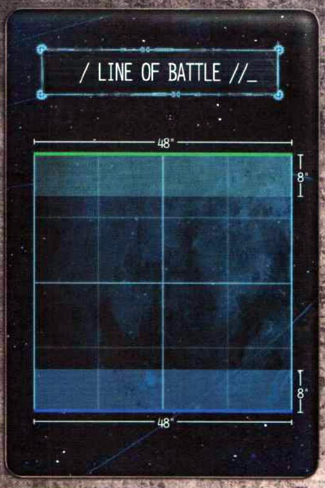
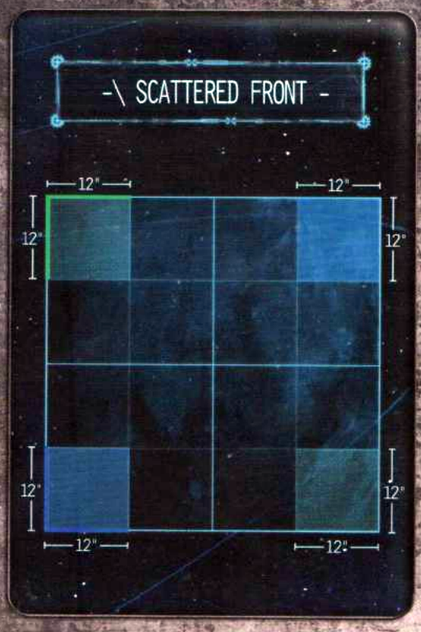
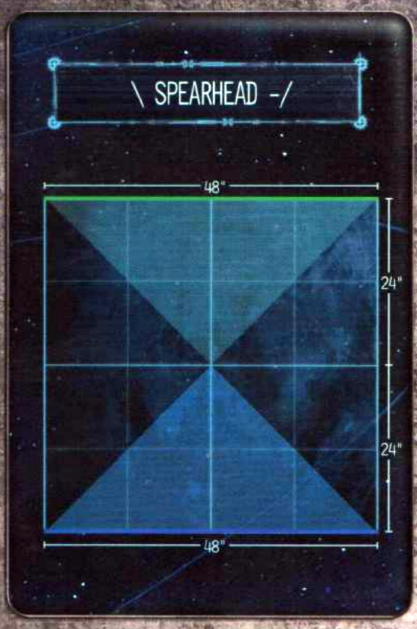
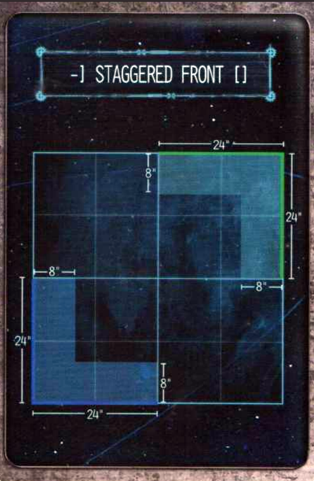
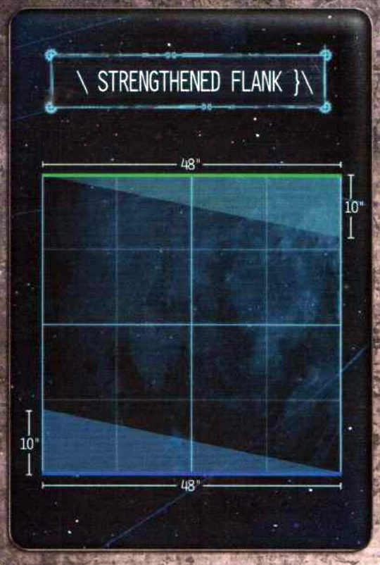

# Open Engine War

## CARD DRAW

Divide the cards into separate decks (Deployment Maps, Primary Objectives, Secondary Objectives, Planetary Effects, and Battlefield Effects).

Shuffle each pile and draw a single card from the Deployment Maps, Primary Objectives, Planetary Effects and Battlefield Effects. Each player then draws two Secondary Objective cards and chooses one of the two as their own.

## DEPLOYMENT MAPS

Deployment Maps detail where players deploy their battlegroups on the battlefield. Players roll-off to determine who has control of the battlefield, with this player choosing one of the two shaded deployment zones to be their deployment zone. Each deployment map has a portion of the battlefield’s edge highlighted in blue or green which represents the player’s respective battlefield edge. Whichever player controls a deployment zone also controls the adjacent board edge.

## PRIMARY OBJECTIVE CARDS

Primary Objective cards detail the victory conditions for the game. Before battlegroups are deployed, place any Objective tokens as detailed on the Primary Objective card. Objective tokens should be represented by a token or base 32mm in diameter.

## SECONDARY OBJECTIVE CARDS

Secondary Objective cards represent the individual goals of each battlegroup. Both players reveal their Secondary Objectives at the same time. Some Secondary Objectives require a player to note down a unit or objective in secret. In these instances the Secondary Objective is revealed but not the specific target.

## PLANETARY CARDS

Planetary cards represent the diversity of worlds throughout the galaxy and the unique challenges they present. Some Planetary cards affect the way terrain is deployed and so a Planetary card should be drawn before the battlefield is set up.

## BATTLEFIELD EFFECTS

Battlefield effects represent the unique challenges offered by the countless different battlefields fought upon by the Titan Legions. Each battlefield effect is a special rule that affects each player equally, forcing battlegroups to adapt their tactics in order to secure victory.

## Deployment Maps

### Chance Engagement

CHANCE ENGAGEMENT

12"          12"

8'          8'

8'          8'

12"          12"

### Confrontation

30"

18"

18"

30"

### Flank Engagement

+/ FLANK ENGAGEMENT //

24" | 24"

14"

14"

14"

14"

24" | 24"

### Fortified Position

[+ FORTIFIED POSITION ]

24"

10"

10"

24"

### Line of Battle

48"

8"

8"

48"

### Scattered Front

SCATTERED FRONT

12"          12"

12"          12"

12"          12"

12"          12"

### Spearhead

SPEARHEAD

48"

24"

24"

48"

### Staggered Front

-] STAGGERED FRONT []

24"

8"

24"

8"

24"

8"

24"

### Strengthened Flank

48"

10"

10"

48"

## Primary Objectives

### Acquisition

After battlefield set-up, but before either player deploys any units, players take it in turns, starting with the player who has control of the battlefield, to place a single Objective token within 12" of the centre of the board. Each token must be at least 8" away from a previously deployed Objective token. When a unit is activated during the Movement phase or Combat phase, a unit within 1" of an Objective token can retrieve it – this is the unit’s activation. If a Knight Banner has retrieved the objective, choose a Knight to carry it. If the model carrying the objective is destroyed, place the Objective token where the centre of the model’s base was.

At the end of the battle, a player gains 15 Victory points for each Objective token they carry or 7 Victory points for having one or more units within 6" of an Objective token that is not being carried and has no enemy units within 6" of it.

### Chokepoint

++ Both forces are attempting to capture a vital strategic location in the centre of the battlefield. ++

During battlefield set-up, an Objective token is placed in the centre of the battlefield. At the start of each End phase both players calculate the total Scale of their units within 6" of the Objective token. The force with the greatest total Scale within 6" of the token is in control of the Objective. If the total Scale of both players’ units is the same, the objective is contested. If a unit is within 6" of the objective, and their force is in control of it, that unit adds 1 to the result of all Command checks it makes.

At the end of the battle, the player in control of the Objective token gains 20 Victory points and an additional 10 Victory points if no enemy unit is within 6" of the Objective token. If the objective is contested, both players gain 10 Victory points.

### Conquest

Both forces are attempting to seize control of their enemy's territory.

At the end of the battle, players earn Victory points as follows:

- 5 Victory points if they have one or more units within 18" of their opponent's board edge.
- 15 Victory points if they have one or more units within 12" of their opponent's board edge.
- 25 Victory points if they have one or more units within 6" of their opponent's board edge.
- An additional 5 Victory points if there are no enemy units within 12" of their own board edge.

### Death and Destruction

At the end of the battle, players calculate their Victory points based upon how much of the total points value of the enemy's battlegroup they have destroyed. Determine the total points value of destroyed enemy units. Units which have not been destroyed but are Structurally Compromised, or in the case of Knight Banner units which have lost more than half of their models, count as half their points (rounding up) when calculating the total points destroyed.

A player gains 10 Victory points for destroying 25% of the total starting points value of the opposing player's battlegroup, 20 Victory points for destroying 50% of the total starting points value of the opposing player's battlegroup or 30 Victory points for destroying 75%+ of the total starting points value of the opposing player's battlegroup.

### Seize and Hold

**Both forces are attempting to seize control of key locations across the battlefield.**

After battlefield set-up, but before either player deploys any units, players take it in turns, starting with the player in control of the battlefield, to place four Objective tokens within 18" of the centre of the board and more than 6" from a previously deployed Objective token. At the end of the battle, both players calculate the total Scale of their units within 4" of each Objective token. The force with the greatest total Scale controls that Objective token. If the total Scale of both players' units is the same, the objective is contested.

Players earn 5 Victory points for each Objective token they control and an additional 5 Victory points if they control two or more Objectives which have no enemy units within 4" of them. 0 Victory points are awarded for a contested objective.

### Wrath and Ruin

**Both forces are attempting to oust their opponent from a fortified position.**

After battlefield set-up, but before either player deploys any units, players take it in turns, starting with the player in control of the battlefield, to each deploy three Objective tokens anywhere within their own deployment zone more than 6" from an already deployed Objective token and more than 5" from a board edge.

If, during the End phase of any round, a unit is within 1" of an Objective token deployed by the opposing player, they may destroy it—remove the token from the battlefield. At the end of the battle, each player gains 10 Victory points for each Objective token their force destroyed.

## Secondary Objectives

### Cut off the Head

**Your battlegroup has been tasked with eliminating the enemy commander.**

After both forces have been deployed, secretly choose one of your opponent’s Princeps Seniores. At the end of the battle, you gain 5 Victory points if the chosen Princeps Seniores’ Titan has been destroyed and an additional 5 Victory points if the Princeps Seniores’ Titan was destroyed in rounds one or two.

If your opponent is using a Knight Household force, the Seneschal’s Lance is the target. At the end of the battle you gain 5 Victory points if all Banners within the Seneschal’s Lance have been destroyed and an additional 5 Victory points if all Banners in the Seneschal’s Lance were destroyed in rounds one or two.

### Expedient Strike

++ Your battlegroup is tasked with enacting a quick and efficient attack intended to strike fear into the hearts of the foe. ++

After both players have deployed their forces, secretly choose two of your opponent's Titans as Primary Targets. At the end of battle, you gain 5 Victory points for each Primary Target destroyed in the first or second round, or 5 Victory points if, at the end of the battle, both targets are destroyed but one or both Primary Targets were destroyed in round three onwards.

If your opponent is using a Knight Household force, discard this Secondary Objective and draw another.

### Hold the Line

++ Your battlegroup is tasked with holding the enemy's advance. ++

At the end of the battle, you gain 5 Victory points for having no enemy units within 18" of your board edge and an additional 5 Victory points if no enemy units are within 24" of your board edge.

### Honour Duel

*++ Your battlegroup commander wishes to prove themself on the field of battle. ++*

After both players have deployed their forces, secretly choose one of your Princeps Seniores. Then choose two of your opponent’s Titans as Honour Targets, one of which must be a Princeps Seniores. At the end of battle, you gain 6 Victory points if your chosen Princeps Seniores destroyed the Princeps Seniores Honour Target, 4 Victory points if your chosen Princeps Seniores destroyed the other Honour Target or 10 Victory points if they destroyed both.

If both you and your opponent are using a Knight Household force then you instead gain 10 Victory points if your Seneschal destroys your opponent’s Seneschal with a Targeted Attack. If only your opponent or you is using a Knight Household force, discard this Secondary Objective and draw another.

### Make Them Suffer

++ Your battlegroup has been tasked with sending a message of pain and suffering. ++

After both forces have been deployed, secretly choose two of your opponent’s Titans as targets. At the end of the battle, you gain 5 Victory points for each chosen target that is Structurally Compromised but not destroyed.

If your opponent is using a Knight Household force, instead nominate a single Banner that contains at least three Knights. At the end of the battle, you gain 10 Victory points if over half of the Knight Banner’s models have been destroyed but the entire Banner has not. If it is not possible to choose targets as stipulated above, discard this Secondary Objective and draw another.

### Martial Pride

Your battlegroup is tasked with proving the superiority of its martial skill.

At the end of the battle, you gain 3 Victory points for each enemy unit you destroyed with a Smash Attack or an attack made by a weapon with the Melee trait, to a maximum of 9 Victory points. An additional 1 Victory point is awarded if one or more of those destroyed units was a Princeps Seniores or was the Seneschal of a Knight Household force.

If none of your units have a weapon with the Melee trait (other than a Smash Attack), you may discard this Secondary Objective and draw another.

### Plant the Standard

After both players have deployed their forces, secretly choose one of your Titans or Knights to carry the Battlegroup’s standard. At the start of any round after the first, a model in your opponent’s deployment zone that is carrying the standard may plant it – place an Objective token within 1" of the model. If the model carrying the objective is destroyed, the standard is dropped; place an Objective token where the centre of the model’s base was.

At the end of the battle, you gain 10 Victory points if the standard was planted and no enemy unit is within 8" of the Objective token or 5 Victory points if either the standard was planted but there is one or more enemy units within 8" of the objective token or if the standard was dropped and no enemy unit is within 8" of the Objective token.

### Preserve the Past

Your battlegroup has been tasked with guarding the life of an important leader...

After both forces have been deployed, secretly choose one of your Princes Seniores. At the end of the battle, you gain 5 Victory points if that chosen Princes Seniores’ Titan has not been destroyed but is Structurally Compromised or 10 Victory points if the Princes Seniores’ Titan has not been destroyed and has not been Structurally Compromised.

If you are using a Knight Household force, you are attempting to keep the Seneschal alive. At the end of the battle you gain 5 Victory points if the Seneschal has been destroyed but at least one Banner from their Lance is alive or 10 Victory points if the Seneschal has not been destroyed.

### Pride in Precision

*Your battlegroup is tasked with proving the majesty of its guns.*

At the end of the battle, you gain 3 Victory points for each enemy Titan destroyed as a result of a Targeted Attack made by one of your units with a weapon without the Melee trait, to a maximum of 9 Victory points. If your opponent is using a Knight Household force, you gain 3 Victory points for each Lord Scion destroyed as a result of a Targeted Attack made by one of your units with a weapon without the Melee trait, to a maximum of 9 Victory points. An additional 1 Victory point is awarded if one or more of those destroyed units was a Princeps Seniores or the Seneschal of a Knight Household force.

If none of your Titans have an arm weapon without the Melee trait, you may discard this Secondary Objective and draw another.

### Secure Ground

**Your battlegroup is tasked with securing an important strategic location.**

After the battlefield has been set-up, but before any forces are deployed, choose a single terrain piece within your deployment zone — this is your Strategic Objective. At the end of the battle, you gain 10 Victory points if no enemy unit is within 12" of the Strategic Objective or 5 Victory points if the total Scale of your units within 12" of the Strategic Objective is greater than your opponent's.

Though following all other normal rules for terrain, the Strategic Objective cannot be destroyed.

### Seize the Quadrants

++ Your battlegroup is tasked with securing as much land as possible. ++

After battlefield set-up, but before any forces have been deployed, divide the table into four equal sections. At the end of the battle, calculate the total Scale of both players' units within each battlefield section. If the total Scale of your units within a section is greater than your opponent's, you gain control of that section. You gain 5 Victory points if you control two or more battlefield sections and an additional 5 Victory points if you control three or more battlefield sections.

### Virulent Messenger

**++ One of your Titans is carrying a viral payload designed to devastate enemy territory. ++**

After both forces have been deployed, secretly choose one of your Titans to carry the payload. At the end of the battle, you gain 5 Victory points if the Titan has been destroyed and a further 5 Victory points if the Titan was destroyed in your opponent’s deployment zone. If the Titan was destroyed in your own deployment zone, you gain no Victory points.

If you are using a Knight Household force and have no Titans in your battlegroup, discard this Secondary Objective and choose another.

## Planetary Effects

### Arctic World

The battle takes place on a world shrouded in ice, its freezing winds deadly to exposed flesh.

During the battle, Titans Vent Plasma on a 3+ rather than a 4+. However, Titans Repair Critical Damage on a 6+ rather than a 5+.

### Arid World

The battle takes place on a world covered in burning deserts, the heat from its sun capable of placing great strain on a Titan's reactor.

During the battle, Titans Vent Plasma on a 5+ rather than a 4+. In addition, at the start of each End phase players roll a D6 for each of their Titans. On a 5+, increase the Titan's Reactor level by 1.

### Blighted World

The battle takes place on a world forever changed by an apocalyptic event unleashed during the Horus Heresy.

All units suffer a -2 modifier to any Command Check they make. In addition, at the start of every End phase each player must pick a single friendly unit. If the unit has active Void Shields, that unit must make D3+1 Void Shield saves. If the unit has no active Void Shields, or is a Knight Banner, they suffer a Critical Hit instead; randomly determine the location for a Titan.

### Death World

The battle takes place on a world known for its dangerous flora and fauna.

The first time each unit attacks in a round, roll a D10 after resolving the attack. On a 1 or 2, the unit suffers a D3 S6 hits as if attacked by a weapon with the Quake trait; Void Shield and Ion Shield saves are allowed against these hits.

### Forge World

++ The battle takes place upon a Forge World and both sides benefit from robust supply lines. ++

Both players get an additional 2 Stratagem points which they can spend on Battlefield Assets. In addition, all Titans increase their Servitor Clades characteristic by 1.

### Hive World

**The battle takes place within a hive city.**

The battlefield should contain a dense amount of urban terrain, with clear sections of the battlefield representing roads or plazas.

### Industrial World

The battle takes place on a world turned over to industry, its surface criss-crossed with promethium pipes and the air thick with industrial gases.

Increase the Strength and Dice Value of weapons with the Firestorm trait by 1. In addition, both players get an additional 1 Stratagem point which they can spend on Battlefield Assets.

### Shattered World

++ The battle takes place on an unstable asteroid or shattered artificial structure with the very ground fracturing beneath the feet of the warring sides. ++

After setting up the battlefield, divide it into 12"x12" sections; the centre four 12"x12" sections are the centre of the battlefield. At the beginning of each End phase, randomly determine a battlefield section; that section shatters. Any model whose base is wholly on the chosen battlefield section is destroyed. Roll a D6 for any model whose base is only partially on the battlefield section, adding 1 to the result if the Scale of the unit is 8 or less, or 2 to the result if the Scale of the unit is 4 or less. On a 6+, the model is moved the shortest possible distance so that its base is no longer on the shattered section. Otherwise, the model is destroyed.

The centre of the battlefield cannot be destroyed. If using the Wrath and Ruin objective, an Objective token counts as destroyed by the opposing player if the battlefield section it is on shatters. A shattered section of the battlefield counts as Deadly Terrain for the remainder of the battle.

### Toxic World

The battle takes place on an inhospitable world, its corrosive air seeps through the smallest of cracks and eats away at anything it touches.

At the start of each End phase, players roll a D6 for each Titan that has suffered Critical Damage. On a 6+, that Titan suffers another point of Critical Damage. If a Titan has more than one location that has suffered Critical Damage, randomly determine the location that suffers Critical Damage. In addition, roll a D6 for each Knight Banner. On a 6+, the Banner suffers D3 S7 hits, ignoring Ion Shields.

### War World

++ This battle is but one of many unfolding across the world and both sides are at risk from the unceasing artillery barrages. ++

During the End phase of each round, each player rolls a D6. On a 2+, the player resolves D6 S8 hits against a target unit of their choice. On a 1, the opposing player chooses a target unit to suffer these hits instead.

## Battlefield Effects

### Conflagration

A raging firestorm consumes the battlefield, growing in size with each passing moment.

The player with control of the battlefield places a marker, representing the centre of the Conflagration, within 1" of the centre of the battlefield. Any Titan within 6" of this marker makes a Vent Plasma Action on a 6+ instead of a 4+. In addition, at the start of the first round's End Phase, Titans within 6" of the marker increase their Reactor level by 1.

At the start of each round, the distance at which units are affected by the Conflagration marker increases by 4", e.g. during the second round Titans within 10" of the marker Vent Plasma on a 6+ and increase their Reactor level, 14" during the third round, etc.

### Corrosive Haze

<+ CORROSIVE HAZE >

++ The battlefield is blanketed with a corrosive
fog that seeps into every crack and decays metal
with a voracious hunger. ++

Whenever a Titan is hit with an attack that targets
a location that has already lost one or more
Structure points, add 1 to the result of all Armour
rolls. If targeting a Knight Banner, add 1 to the
result of all Armour rolls if the Banner has lost
one or more Structure points.

### Flooded Battlefield

++ The battlefield is flooded, hindering the movement of Knights and Titans alike. ++

Titans cannot move more than a total of 8" during their activation. Knight Banners have their movement halved, but attacks against Knight Banners incur a -1 modifier to all Hit rolls.

In addition, if a Titan successfully Vents Plasma in the Damage Control phase, all attacks made against it in the following Combat phase have a -1 penalty to their Hit rolls, so long as the Titan does not move (voluntarily or involuntarily) after making a Vent Plasma Action.

### Geysers

**The battlefield is riddled with geysers that regularly erupt.**

At the start of each Strategy phase, both players, starting with the player who is not the First Player, may place a 5" Blast marker, representing a geyser eruption, anywhere on the battlefield. Any attack that draws line of sight through a geyser eruption suffers a -2 modifier to all Hit rolls.

All geyser eruption Blast markers are removed during the End phase.

### Lightning Storm

++ The battlefield is shrouded in an electrical storm that disrupts active Void Shields and could damage unprotected Titans. ++

All weapons gain the Voidbreaker (1) trait or, if they already have the Voidbreaker (X) trait, increases the value in brackets by 1. In addition, at the start of every End phase roll a D5 for each Titan with a Void Shield level of X. On a 5+, the Titan is struck by lightning. Resolve a single S8 hit against the Titan’s Body.

### Mist

The battlefield is cloaked in a dense mist that obscures combatants from enemy guns.

Subtract 1 from the result of all Hit rolls made for attacks against a target more than 15" away from the attacking unit.

### Pitch Black

++ The two forces battle under the cover of darkness or in a subterranean cavern devoid of light. ++

Units can only make attacks against targets within 12" of the attacking unit unless the target unit has already made an attack with a weapon without the Melee trait or has made the Vent Plasma Action this round.

### Radiation

++ Areas of the battlefield are saturated with radiation, which drifts across the landscape contaminating all it touches. ++

After both forces have deployed, players take it in turns, starting with the player who has control of the battlefield, to deploy a total of three markers representing the drifting radiation.

At the start of each Strategy phase, the player who is not the First Player moves two Rad markers and their opponent moves one Rad marker. Rad markers can be moved up to 6" in any direction.

Each time a Titan within 3" of a Rad marker pushes its reactor, the controlling player rolls two Reactor dice and must choose the result that increases the Reactor level by the most.

### Thick Smog

The air is thick from smog belching from the local manufactoria, rendering most blind to all but the closest foes.

Attacks made against a target by a unit that is further away than twice the target's Scale in inches automatically miss. If the attack was made with a weapon with the Blast (X) trait, nothing under the Blast marker is hit and the marker does not scatter.

### Unstable Ground

++ The ground is precarious and prone to collapse under the heavy tread of a Titan. ++

Whenever a Titan declares Power to Locomotors!, before moving it, roll a D10. On a 1 or a 2, the Titan can only move up to its base Movement characteristic and, after moving, suffers D3 S6 hits to its Legs, ignoring Void Shields, as if successfully hit by a weapon with the Quake trait.

### Vox Ghosts

++ Vox echoes flood the communication networks of both forces, leading to miscommunication and confusion. ++

If a unit rolls a natural 1 when making a Command check, the opposing player may issue the unit an Order of their choice without the need to make a Command check. A Shutdown order cannot be issued in this manner.

### Vox Screech

**++ An unceasing screech of tortured binary echoes across the battlefield. ++**

Whenever the Machine Spirit symbol is rolled on the Reactor dice no Command check is made - the Machine Spirit always awakens. Psi-Titans and Corrupted Titans are unaffected by this rule.
