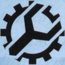
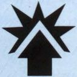
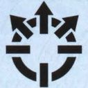
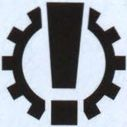
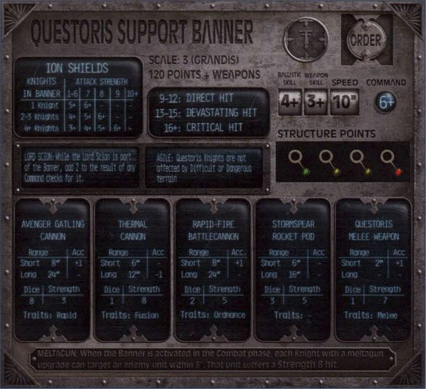

## Stratagems and Orders

### Strategy Phase Sequence

In the Advanced Rules, the Strategy phase has three steps, which must be carried out in order:

1. Determine First Player (as described on page 22)
2. Enact Stratagems
3. Issue Orders

#### 2. Enact Stratagems

If either player has any Stratagems (as described by the mission that is being played), many of them can be played at this step of the Strategy phase. Starting with the First Player, the players take turns enacting a single Stratagem. If one player has finished enacting Stratagems but their opponent still has some remaining, their opponent can enact all of them in an order of their choice.

#### 3. Issue Orders

In the Advanced Rules, the bulk of the Strategy phase is taken up by issuing orders. Orders give units a bonus in certain phases, but also impose a penalty. Players do not need to issue any orders to their units - those that are not issued orders will act on their initiative, moving, repairing and attacking as they do in the Basic Rules.

In this step, the players take turns activating a unit and issuing an order to it, starting with the First Player. When one player runs out of units to activate or does not wish to activate any more units, the other player activates each of their remaining units in turn.

When a unit is activated in this step, the controlling player chooses an order from the table on page 42, then makes a Command check. If the check is successful, an Order dice is placed on the "Order" space on the Titan's Command Terminal, with the chosen order showing. If the check is failed, the order is not received; the chosen unit does not receive an order, and the controlling player cannot issue any more orders this phase.

In the End phase, all orders (except Shutdown orders) come to an end and their dice are removed from any Command Terminals.

---

**Shutdown Orders**

Shutdown orders are not automatically removed in the End phase. Instead, when a Titan with Shutdown orders is activated in the Strategy phase, the controlling player can attempt to restart its plasma reactor, as long as its Plasma Reactor Status marker is not in a hole with an orange or red indicator. Roll a D6, adding 2 to the result if the Titan's Reactor Status marker is on the first space of the track. On a result of 5 or more, the Shutdown orders are removed. Otherwise, they remain in place. In either case, a Titan that starts the Strategy phase with Shutdown orders cannot be issued any other orders that phase.

---

### Available Orders

{ width=127 height=127 } **Emergency Repairs:**

As soon as an Emergency Repairs order is issued, make a Repair roll for the unit (see page 32), adding 1 to the result of each dice. If a unit with Emergency Repairs orders is activated in the Movement phase, it cannot be activated in the subsequent Combat phase.

{ width=127 height=127 } **First Fire:**

When a unit acting under First Fire orders is activated in the Movement phase, it cannot move or make turns. Instead, pick one of its weapons to attack with, following the full Combat Sequence on page 33. Note that the attacking weapon must be declared before selecting a target. This does not prevent the unit from using that weapon again in the Combat phase.

{ width=127 height=127 } **Charge:**

In the Movement phase, a unit acting under Charge orders can only move within its Front arc, and once it starts moving, it cannot make any turns. However, once it has finished moving, it can immediately make either a Smash Attack (see page 36) or an attack with a weapon that has the Melee trait. Add 1 to the attack's Dice value for each full 3" that the model moved before attacking. Note that this does not stop the unit making a Smash Attack in the Combat phase.

{ width=127 height=127 } **Split Fire:**

A unit acting under Split Fire orders cannot make any turns in the Movement phase. However, in the Select Target step of the Combat phase (see page 33), a different target can be declared for each of the unit's weapons.

{ width=127 height=127 } **Full Stride:**

A unit acting under Full Stride orders cannot attack in the Combat phase. Instead, when it is activated, it can move a number of inches up to its Speed. This move must be made within the unit's Front arc. It cannot make any turns before, during or after this move, and the move must be made in a single straight line.

{ width=127 height=127 } **Shutdown:**

If a unit with void shields is issued Shutdown orders, its void shields collapse immediately. A unit with Shutdown orders cannot be activated in the Movement phase or Combat phase. Reactor rolls cannot be made for a unit with Shutdown orders (even if instructed to do so). Shutdown orders are not automatically removed in the End phase (see page 41). A unit that has Shutdown orders at the end of the battle counts as destroyed.

When activating a Titan acting under Shutdown orders in the Damage Control phase, reduce its Reactor level by 2 before making its Repair roll.

## Wartorn Landscapes

There are several types of terrain in Adeptus Titanicus - each of which has an effect on gameplay. When setting up the battlefield, the players should agree what each piece of terrain counts as, defining its boundaries and any additional special rules that will be applied to it.

### Terrain Types

The Titan Legions have strode to war on every type of terrain, from frozen tundra to sweltering rainforests. No two battlefields are alike, and a canny Princeps will use the lay of the land to their advantage.

**Blocking Terrain.** Blocking terrain includes intact buildings, monuments, gigantic alien trees or anything else that is solid enough to impede a Titan's progress. Units cannot voluntarily move through Blocking terrain. If a unit is forced to move through Blocking terrain, it stops in base contact with it and suffers a collision as described on page 31. A Titan can move across Blocking terrain if its height in inches is less than half its Scale, and its width (measured at the point it is moving across) is no wider than the Titan's base - however, it can never end its move standing on top of Blocking terrain.

**Difficult Terrain.** This includes large areas of rubble or debris, ruined buildings, areas of forest and anything else which Titans can move through or across, but which will slow their progress. Difficult terrain should have a clear boundary - for example, for a ruined building, the walls should provide a clear indication of where the Difficult terrain starts and ends. For each 1" that a unit moves through Difficult terrain, it counts as having moved 2".

**Dangerous Terrain.** This includes anything that could potentially harm a unit that attempts to cross it. Roaring rivers, pools of magma or fields of thermal mines are all examples of Dangerous terrain - in most cases, Dangerous terrain will also be considered to be Difficult terrain too. After a unit moves through Dangerous terrain, it suffers a hit to its legs at Strength 3 plus 1 for each full 1" of Dangerous terrain it moved through. These hits bypass void shields and ion shields.

**Deadly Terrain.** Deadly terrain includes ravines, sheer drops, roiling warp vortexes and anything else that would destroy anything foolish enough to wander into it. If a unit moves into Deadly terrain, it is destroyed (if it is a Titan, roll on the Catastrophic Damage table).

---

**Designer's Note**

**Wobbly Model Syndrome**

As detailed as Adeptus Titanicus models may be, they have their limitations. If you find a situation where a model cannot be placed in the exact spot that you would like it to be, and which it would be able to reasonably stand in if it were poseable and did not have a base, place it as close as possible and agree with your opponent where it is actually standing. Move it and hold it in place as necessary to resolve lines of sight, fire arcs and so on, returning it to its temporary position whenever it is not necessary to know its actual location.

---

## The Plasma Reactor

### Reactor Dice

In the Basic Rules, when a Titan's reactor is pushed (usually to get an in-game bonus), its Plasma Reactor Status marker is advanced. When playing with the Advanced Rules, the Reactor dice is used instead, offering a greater risk, but a potentially greater reward.

Three sides of the Reactor dice are marked with a single Reactor symbol. One side has two Reactor symbols, and one side is blank. The final side has a Reactor symbol surrounded by a cog - this is the Machine Spirit symbol. To push the reactor, instead of automatically advancing the Status marker, roll a Reactor dice. If a single Reactor symbol (or the Machine Spirit symbol) is rolled, advance the marker. If two Reactor symbols are rolled, advance the marker twice. If a blank is rolled, the marker is not advanced at all.

Some rules (such as a Reactor Leak, listed under Critical Damage on page 35) state that a Titan's Reactor Status marker is advanced. This is not the same as pushing the reactor, so the Status marker is simply advanced.

Note that if the Reactor Status marker is in a hole with a red indicator when it should be advanced, the Titan still suffers a Strength 9 hit to the Body (bypassing void shields) as per the rules on page 34.

### Reactor Overload

When a Titan is activated in the Damage Control phase of each turn, and its Reactor Status marker is in a hole with an orange or red indicator, its reactor might overload. In the Basic Rules, the Titan would suffer a number of hits - in the Advanced Rules, the controlling player must instead roll on the Reactor Overload table below. If the marker is in an orange hole, roll a D6. If it is in a red hole, roll a D10.

#### Reactor Overload Table

| Roll | Result |
|---|---|
| 1-2 | **Reactor Housing Damaged:** The Titan suffers a Strength 9 hit to its Body, bypassing void shields. |
| 3-5 | **Power Failure:** The Titan's void shields collapse immediately. If the void shields have already collapsed, treat this as a roll of 6-8 instead. |
| 6-8 | **Plasma Leak:** The Titan suffers D3 Strength 9 hits to its Body, bypassing void shields. |
| 9-10 | **Reactor Meltdown:** The Titan is destroyed. Roll a D3 and add the number of holes on the Titan's Plasma Reactor Status track - each model within that many inches of the Titan before it is removed is hit by the blast. Each unit that is hit suffers D6 hits, bypassing void shields, with a Strength equal to the Titan's Scale+1. |

### Awakening the Machine Spirit

Although the Princeps has de facto command of their Titan, the connection between the two is a lot more complex than that between machine and operator. Interfacing through a Mind Impulse Unit, the Princeps effectively becomes the Titan, controlling it as though it were their own body. However, the connection works both ways and the Princeps feels the tug of the Titan's machine spirit, the vital force at the heart of the god-machine. In times of great duress, it is not unknown for the machine spirit to rise to the surface and take control for a moment before the Princeps' will is reasserted.

If a Reactor roll shows the Machine Spirit symbol, the Titan's anima is roused by the crew's attempts to push its reactor beyond its limits. After advancing the Reactor Status marker, make an immediate Command check for the Titan, interrupting the current Action. If the test is passed, there is no effect and the Titan can continue with its Action (with the benefit for having pushed the reactor). If the Command check is failed, the machine spirit awakens.

If the Titan is currently performing an Action, its Action ends immediately. For example, if the Titan is currently moving and has pushed its reactor to power its locomotors or stabilisers, it cannot move or turn any more this phase. Similarly, if it is making an attack and has pushed its reactor to power one of its weapons, the attack ends immediately (it could continue attacking with any remaining weapons once the result from the table has been resolved). If the Titan is not currently performing an Action - for example, if the reactor is being pushed to power the Titan's void shields during an attack by another Titan - there is no effect and it still makes its Shield saves (with the benefit of having pushed the reactor).

Then, roll a D6 and look up the result on the Awakened Machine Spirit table that follows.

#### Awakened Machine Spirit Table

| D6 | Result |
|---|---|
| 1 | **Haughty:** Other than ending the current Action, there is no effect. |
| 2 | **Stalwart:** Make a Repair roll for the Titan. Its effects are applied immediately - if the controlling player is about to make a Shield save and they make a Raise Shields Repair Action, they use the new Shield level for the Save roll. |
| 3 | **Impetuous:** The Titan moves D6" straight forwards, stopping before it collides with anything. At the end of the move, it turns up to 45° towards the nearest enemy unit, stopping if the enemy is directly ahead of it. |
| 4 | **Belligerent:** The Titan moves D6" towards the nearest enemy unit within its Front arc, stopping if it moves within 1" of another unit. If there are no enemy units within its Front arc, it turns 45° towards the nearest enemy unit instead of moving, stopping if the enemy enters its Front arc. Then, if there is an enemy unit within 1" and within its Front arc, it makes a Smash Attack against that unit. |
| 5 | **Predatory:** Choose one of the Titan's weapons at random, using the table on its Weapon Hit location. If that weapon has been disabled, or if there are no enemy units within its firing arc, treat this as a result of Belligerent instead. Otherwise, the Titan attacks with the chosen weapon, targeting the nearest enemy unit within its arc, and using a Ballistic Skill of 4+. |
| 6 | **Wrathful:** The controlling player chooses one of the Titan's weapons that has not been disabled and attacks with it, using a Ballistic Skill and Weapon Skill of 4+, following the standard Combat Sequence (see page 33). |

---

### Unusual Situations

**Moving during the Enemy's Activation.** If the machine spirit is awakened during an enemy Titan's activation - usually when pushing the reactor to declare Voids to Full! - there are several odd situations that can arise if an Impetuous or Belligerent result causes the target Titan to move.

If the Titan moves out of the attacking weapon's range, arc or line of sight, the attack is still resolved - after all, the Hit roll has already been made, so shots have already hit the target. Similarly, if the Titan moves so that the attacker is now in another of its arcs (it was in the Front, for example, but after the Titan moves the attacker is in its Side where its armour is weaker), this is not taken into account for the current attack. Any subsequent attacks, by the same unit or a different unit, use the Titan's new position - check the range, line of sight and arc again.

**Interrupting its own Attacks.** If the machine spirit is awakened during its own attack, and a Predatory or Wrathful result causes it to attack with one of its weapons, it does not need to fire at the same target it was already targeting. Similarly, any subsequent attacks it makes do not have to target the unit that was targeted by the machine spirit's attack (indeed, they must target the Titan's original target, unless it has Split Fire orders).

**Measuring Ranges out of Sequence.** If an Impetuous, Belligerent or Predatory result requires the player to determine the nearest enemy unit and there is more than one-unit which looks as though it might be the nearest, they are allowed to measure the distance to each of them to determine which of them is the actual nearest unit.

**Automatic Weapons Fire.** When a Predatory or Wrathful result leads to an attack being made, the weapon is used in its default state - it cannot take advantage of an optional fire mode such as Shieldbane (Draining) or Maximal Fire.

---

## Squadrons

Some Titans (generally the smaller ones such as Warhound Scout Titans) have the option to fight in "Squadrons", as shown on their Command Terminal. This lets them coordinate their attacks and even combine their void shields, acting as more than the sum of their parts on the battlefield.

### Designating Squadrons

Before deploying their force at the start of a battle, a player can arrange any of their eligible Titans into Squadrons. They count as a single unit for purposes of deployment (in other words, if the players take turns deploying a unit, all of the Titans in a Squadron would be deployed at the same time), but are counted as separate units once the battle begins.

### Activating Squadrons

Titans in a Squadron are activated as a group, i.e., at the same time. In other words, when it is a player's turn to activate a unit, they can activate a Squadron. Titans that are part of a Squadron cannot be activated individually.

When a Squadron is activated, each Titan in the Squadron is activated in turn, in an order chosen by the controlling player. The first must complete its activation before the second is activated, and so on. The controlling player can change the order in which units in a Squadron are activated each time they activate the Squadron. If a Titan in the Squadron cannot be activated, due to damage or an order, this does not prevent the rest of the Squadron from being activated.

---

**Designer's Note**

**Wide Ranging Squadron**

If you have used vehicle squadrons in some of our other games, it might seem at first as though we've missed something - there's nothing about Titans in a Squadron having to stay within a certain distance of each other. This is fully intentional - Titans which are within a Squadron are still fully autonomous (they are, after all, Titans!), but still work to support each other.

---

### Squadron Orders

In the Strategy phase, multiple Titans in a Squadron can be issued the same order at the same time - this is referred to as a Squadron order. Note that not all of the Titans in the Squadron need to be issued the Squadron order. For example, a player with a Squadron of three Warhounds could issue Full Stride as a Squadron order to two of the Titans, but leave the other to act on initiative or issue a different order.

When issuing Squadron orders, use the highest Command value of the Titans that are being issued the order. Add 1 to the result of the Command roll for each additional Titan after the first that is being issued the Squadron order. If the order is successfully given, put an appropriate Order dice on the Command Terminal of each Titan that was issued the order.

### Coordinated Strikes

Squadrons are at their most effective when attacking the same target. Warhounds in particular have become infamous for their hunting packs, used to great effect in bringing down larger enemy Titans.

When a Squadron is activated in the Combat phase (but not in the Movement phase, even if its Titans are on First Fire orders), the controlling player can elect to make a Coordinated Strike. When they do so, pick a target for the attack, then nominate two or more Titans in the Squadron to contribute to the attack.

Each contributing Titan must target the chosen unit (with at least one of its weapons if the Titan has Split Fire orders). Any Armour rolls for attacks made as part of a Coordinated Strike have a +1 modifier.

### Merging Void Shields

One tactic often used by Titan squadrons, especially when facing larger Titans, is to align their void shields, merging them to improve their durability and protection. This can mean the difference between survival and annihilation, but can risk collapsing both Titans' shields.

If a Titan's base is touching the base of another Titan in the same Squadron, they can merge their void shields. If either of the Titans is attacked, the controlling player can use the Void Shield level of either Titan. If any saves are failed, they can pick which of the Titans' Void Shield levels is reduced, and can even split it between them.

## Household Support

When a maniple goes to war, it is often supported by Banners of Knights, compact war engines piloted by nobles of the Knightly Households. When engaging enemy Titans they act with a single purpose, fighting in packs to harry their great foes like primitive hunters tackling a mighty beast. Although a Banner is rarely able to bring down a Titan by itself, a cunning general will use them to provide harassing fire and add mobility to their force.

### Banner Command Terminals

{ width=611 height=558 }

Each Banner has a Command Terminal in the same way as a Titan. Most of the information on the Command Terminal will be familiar (Class, Scale, Order space, Characteristics and so on) but as Knights are much smaller than Titans, they do not have multiple Hit locations. Instead, they have a single Damage table and Structure Points Status track. As such, it is never necessary to roll the Location dice when attacking a Banner.

Instead of void shields, Knights have ion shields, which are described on page 47 and summarised on their Command Terminal. Note that Knights do not have plasma reactors, so can never make Reactor rolls.

### Composition of a Banner

A Banner is made up of a number of Knights acting as a single unit. The reverse of a Banner's Command Terminal describes its exact composition, along with any options. When a Banner is activated, all of the Knights within it act; individual Knights cannot be activated.

### Banners in the Strategy Phase

A Banner can be issued orders in the same way as a Titan. It cannot be issued Damage Control or Shutdown orders.

### Banners in the Movement Phase

When a Banner is activated in the Movement phase, each Knight can move up to the Banner's Speed characteristic in inches. Knights are considered to have a 360° Front arc, and can make as many turns as they wish as they move. When the Banner has finished moving, each must be within 3" of another Knight in the Banner - Knight Banners operate in much closer proximity than Titan Squadrons, especially when facing larger war engines. If any of the Knights are outside of this range, the Banner is Shaken - see page 47.

### Banners in the Damage Control Phase

Banners cannot be activated in the Damage Control phase.

### Banners in the Combat Phase

When a Banner is activated in the Combat phase, it follows the Combat Sequence as if it were a Titan. Instead of attacking with each Knight individually, make an attack with each different weapon in turn. For each weapon, multiply the Dice characteristic by the number of Knights in the Banner that are equipped with that weapon, and which are within range and line of sight of the target. For example, if a Banner has two Knights armed with rapid fire battle cannon (Dice 2) and one Knight armed with a thermal cannon (Dice 1), it would roll four dice when attacking with the battle cannon and one dice when attacking with the thermal cannon. If some Knights are within 2" of the target and others are further away, roll using Ballistic Skill for those that are further, and Weapon Skill for those that are within 2".

When determining line of sight for a Banner, Knights within the Banner do not block the view of others. Also, remember that Knights have a 360° Front arc, so their weapons can fire in any direction. All of the weapons in a Banner must be fired at the same target, unless the Banner has Split Fire orders, at which point each weapon can be directed at a different target.

Banners cannot make Smash Attacks.

**Attacking Banners.** When attacking a Banner, pick a single Knight in the Banner to be the target of the attack. This model is used for purposes of range, line of sight and so on. However, any damage that is caused is applied to the Banner as a whole. As Banners do not have Side or Rear arcs, these do not cause modifiers to the Damage roll.

**Ion Shields.** When fighting in a Banner, Knights align their ion shields, granting them greater protection as a group than individually. Ion shields are different to void shields; if a rule refers specifically to void shields, it does not affect ion shields, but if it refers to Shield saves, it will affect both. Note that, unlike void shields, ion shields can be used against attacks that originate from within 2".

If a Banner is hit by a shooting attack, hits are resolved (at Step 5 of the Combat Sequence) as follows:

- Target's controlling player makes Ion Shield saves.
- The attacking player makes Armour rolls for any remaining hits.

To make an Ion Shield save, look up the Ion Shield level on the Banner's Command Terminal, which varies depending on the number of Knights currently in the Banner and the Strength of the attack. Then roll a D6 for each hit that was scored. For each dice that equals or beats the Ion Shield level, the hit is discarded. Then for each remaining hit, the attacking player makes an Armour roll as described on page 34.

**Damaging Banners.** Direct Hits, Devastating Hits and Critical Hits affect Banners differently to Titans, as follows:

**Direct Hit:** When a Banner suffers a Direct Hit, it loses a Structure point. If it has no Structure points left to lose, one Knight in the Banner is destroyed instead.

**Devastating Hit:** When a Banner suffers a Devastating Hit, it loses two Structure points. If the Banner has one Structure point or no Structure points left when it suffers a Devastating Hit, one Knight in the Banner is destroyed instead.

**Critical Hit:** When a Banner suffers a Critical Hit, it loses two Structure points, then one Knight in the Banner is destroyed. If the Banner has one Structure point or no Structure points left when it suffers a Critical Hit, two Knights in the Banner are destroyed instead.

When a Knight is destroyed, the controlling player chooses one model to remove. The Banner's Structure Points marker is then immediately reset to the first hole of the track. If a Targeted Attack destroys a Knight, the attacking player can choose which model to remove instead of the controlling player.

**Blast Markers, Flame Templates and Area Effects.** When a Banner is hit by a Blast marker or Flame template, total the number of hits scored on the models in the Banner, then apply that many hits to the Banner as a whole. This also applies to attacks with an area effect - catastrophic reactor overloads, environmental effects and so on.

### Shaken Banners

Each time a Knight is removed from a Banner, the Banner must make a Command check. If it is failed, the Banner is Shaken. It immediately loses any orders and an Order dice showing the Shutdown symbol is placed on its Command Terminal to show that it is Shaken. Shaken Banners subtract 3" from their Speed and will suffer a -1 modifier to all Hit rolls.

When the Banner is activated in the Issue Orders step of the next Strategy phase, make a Command roll for the Shaken Banner. If it is passed, remove the dice. Otherwise, it stays where it is. In either case, the Banner cannot be issued orders.
