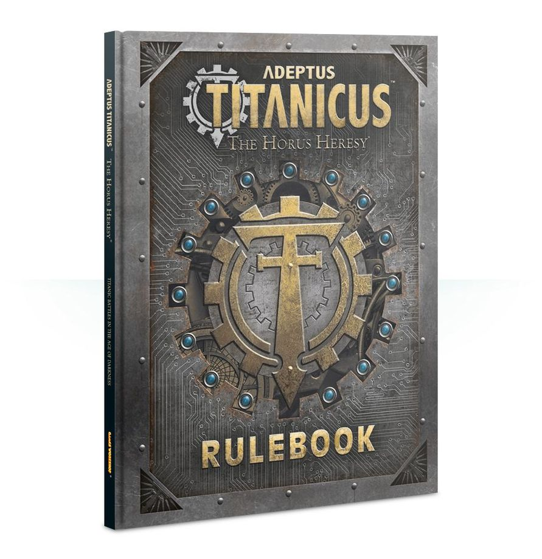

This section of Adeptus Titanicus presents all of the core rules needed to play the game. They are sub-divided into Basic, Advanced and Optional Rules, and there is no need to read them all at once. It is recommended that players read and absorb the Basic Rules before playing a few games with them, and later try their hand at more detailed games.

## Introduction

Adeptus Titanicus is a strategic tabletop wargame in which two or more players command battlegroups of mighty Titans, colossal humanoid war engines which can level cities with a single salvo. Each player takes control of a handful of these great machines, represented on the tabletop by detailed Citadel miniatures. For many people, the mere act of collecting, assembling and painting these miniatures is enough, but this section of the book is aimed at those who wish to take things one step further and engage in grand tabletop battles.

A game of Adeptus Titanicus is many things. It is a strategic challenge in which you pit your skill and cunning against your opponent in a battle to the death. It is a test of tactical skill, demanding that you consider the resources at your disposal and determine the best way to react to the changing state of the battlefield. Most pertinently, it is a cinematic event, a clash on an unprecedented scale, where you will find yourself celebrating with each direct hit you score, and feeling a true sense of peril should your Titan's precious void shields collapse.

However, this book is only the beginning. New supplements and miniatures will be released as time goes by, adding additional Titan Classes and weapons to the game or focussing on different ways to play, or different theatres of war. There is an entire universe to be explored, and by reading this book you will take your first steps on a long and rewarding journey.

---

**Designer's Note**

**To Princeps of Old...**

This is not the first time that Games Workshop has released a game centred around Titans going to war, and indeed not the first time that the title Adeptus Titanicus has been used. Veteran players will note that this is a brand new game system rather than a polished re-release of existing rules, but it stands on the shoulders of giants (giant walking robots, that is!). We have made every effort to be respectful to the games that came before, borrowing ideas and marrying new mechanics with old in the hope of creating a game that will appeal to veteran players as much as it does to the new blood. We're really pleased with the result, and hope that you are too.

{ width=891 height=920 }