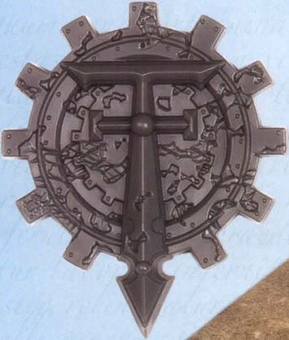
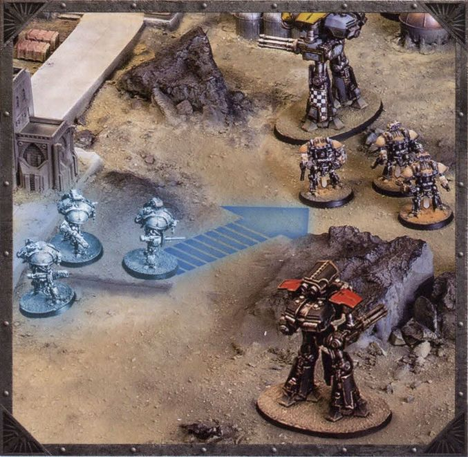
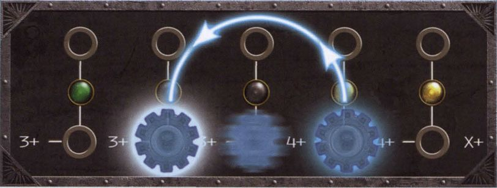
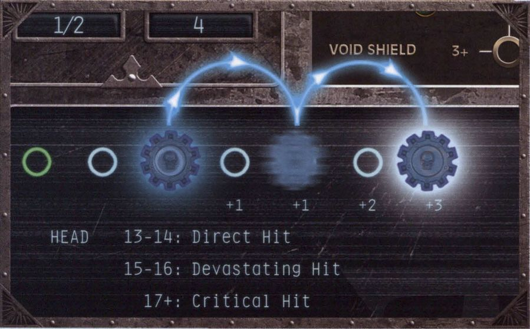
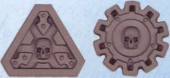
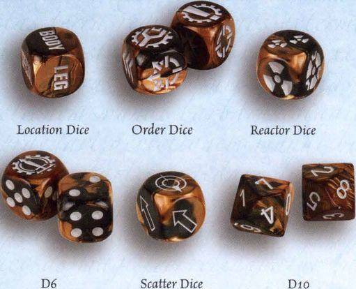
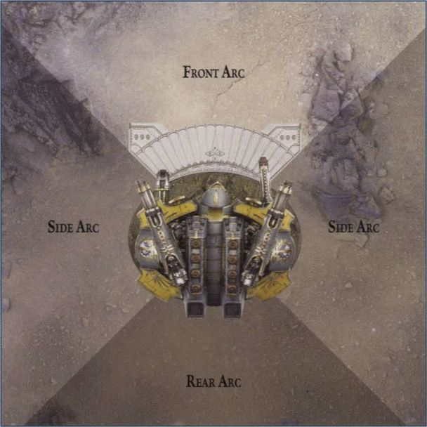
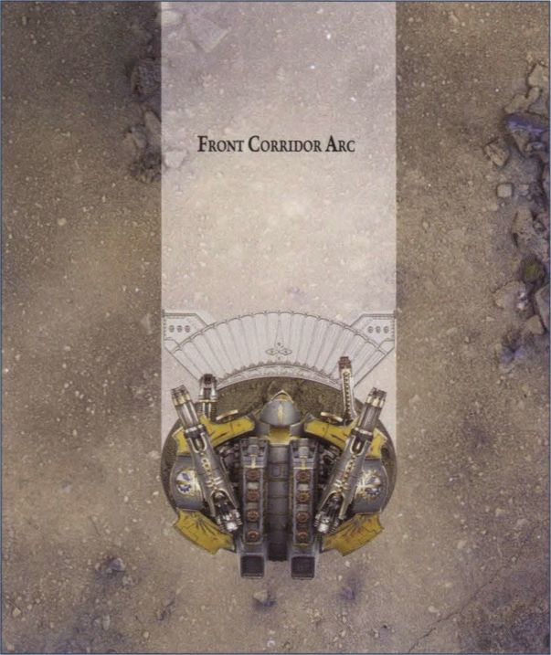
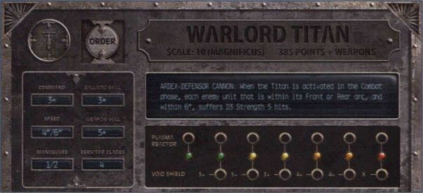
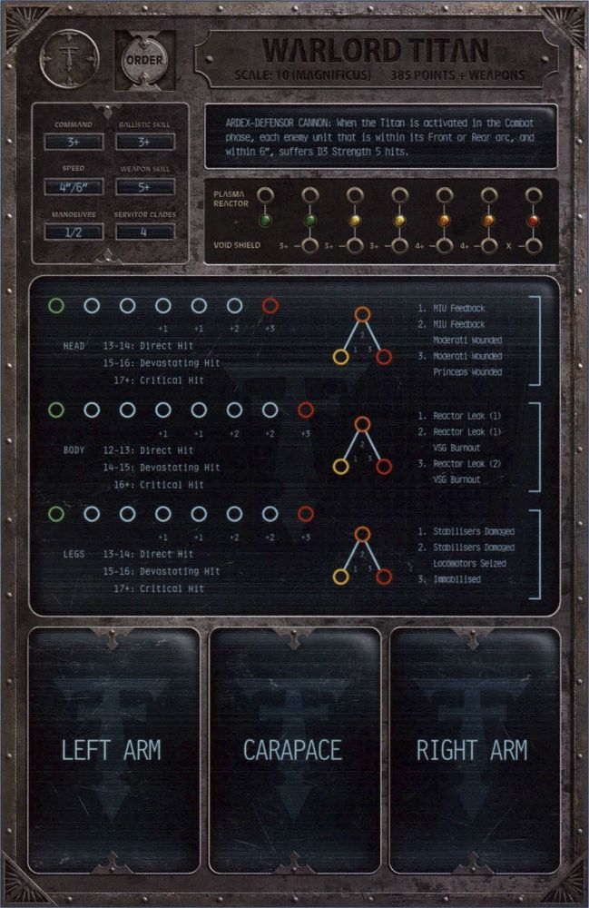

## A Battle in Progress

Although Adeptus Titanicus is ultimately a fairly simple and intuitive game to learn - especially for those who are already familiar with other Games Workshop games - it can seem like there are a lot of rules to learn. These pages are intended to show new players an example of the rules in action, demonstrating the steps that take place during a full round of gameplay. Looking them over and reading through the highlights should give players a good overview of the game, which should make the rules that follow easier to understand.

### Rounds and Phases

The game is split into a number of rounds. Each round progresses through five phases in a fixed order: Strategy, Movement, Damage Control, Combat and End. In most phases, players take turns activating one of their units and making an Action with it. In the Movement phase, for example, the unit could move.

#### 1. The Strategy Phase

At the start of each round is the Strategy phase. Each player rolls a D10, and the highest scoring player chooses who will be the First Player for this round. In each phase during their round, the First Player is always the first to activate a unit.

*The Opus Titanica emblem is given to the First Player each round.*

#### 2. The Movement Phase

When a unit is activated in this phase, it can move. Each Titan has a Speed characteristic, to show far it can move, and a Manoeuvre characteristic, to show how many times it can make a turn of up to 45°. Knights are a little different to Titans; being much smaller and more nimble, they only have a Speed characteristic and can make as many turns as they wish when they move.

A battle can be won or lost in the Movement phase, as each unit's weapons have specific fire arcs which must be taken into consideration. A Warlord might have the firepower to obliterate a lesser Titan in a single salvo, but it is for naught if the target is canny enough to stay out of the line of fire!

*Knight Banner Zholon-Kuthos of House Malinax darts forward to attack the Legio Gryphonicus Reaver Aeterno Rex, moving close enough to bypass its void shields and preparing to target its weaker Rear armour.*

#### 3. The Damage Control Phase

Titans can suffer horrific damage during battle, and their reactors can run hot enough to risk a catastrophic overload. Thankfully, each has a crew of Enginseers and servitors dedicated to the task of keeping them in the fight. When a Titan is activated in this phase, the controlling player makes a Repair roll then spends the dice to raise fallen void shields, fix critical damage or vent plasma to stave off a reactor overload.

*The Gryphonicus Warlord Iron Regent suffered several hits last round. Its void shields held, but several of its generators failed and the shields might not survive another salvo. Thankfully, a good Repair roll allows Iron Regent to make the Raise Shields Action twice, restoring its shields to almost full capacity.*

#### 4. The Combat Phase

When a Titan is activated in this phase, it attacks with each of its weapons. In the early stages of a game, it is unlikely that any actual damage will be dealt, as each Titan is protected by several layers of nigh-impenetrable void shields. However, as gunfire overloads the shield generators and strips this protection away, attacks will begin to chew through enemy Titans' armour and cause critical damage.

A cunning Princeps will carefully consider the order in which they make their attacks. High rate-of-fire weapons are ideal for stripping void shields, whereas devastating single-shot weapons are best kept for when the shields have fallen.

*Thanks to the combined firepower of the Legio Gryphonicus Titans, the Legio Mortis Warlord Ire Incarnatus has lost its void shields. It suffers a punishing salvo to the head, taking a pair of Devastating Hits which cause it to lose a total of 4 Structure points. This moves its Status marker to the end of its track, meaning that any further damage to that location will be critical...*

**Inflicting Damage.** Once a Titan's shields have collapsed, each of its Hit locations will begin to take structural damage. Eventually, its structure will be compromised and it will start suffering critical damage - systems will fail, weapons will be disabled and the Titan may finally be destroyed! No Titan dies quietly, however, and the death of a war engine is often accompanied by a large explosion that threatens to annihilate anything nearby...

*Status markers are used on each Titan's Command Terminal to track a number of elements (such as void shield strength and the damage suffered at each location). The plastic sprue features two different designs of Status marker, which can be used interchangeably.*

## Getting Started

### Dice

Adeptus Titanicus uses six types of dice, including three types of bespoke dice: Reactor dice, Location dice and Order dice - which are specifically designed for this game.

**D6.** Regular six-sided dice are used for most rolls in the game. To differentiate them from other dice, they are referred to throughout the rules as D6. It may be necessary to roll several dice and add the results together - this is represented by a number before the D6, so rolling 2D6 involves rolling two D6 and adding the results together. If it were necessary to roll two D6 and count the results separately, this would be denoted as "two D6".

Sometimes, the rules might call for a D3 - this is shorthand for rolling a D6, halving the result and rounding the result up. So, a 1 or 2 counts as 1, a 3 or 4 counts as 2 and a 5 or 6 counts as 3.

Note that the dice included with Adeptus Titanicus have the Opus Titanica printed in place of the 6. This is purely decorative and is treated as a 6 for all purposes.

**D10.** Ten-sided dice are used for certain rolls in the game, such as Command checks and Catastrophic Damage rolls. Sometimes, the rules might call for a D100. This roll is made by rolling two D10 one after the other, counting the first as tens and the second as units, to get a result between 1 and 100. For example, a roll of 5 then 6 would be a result of 56. If the first roll is a 10, count it as 0 (so a roll of 10 then 7 would be a result of 07), but if both dice roll a 10, the result is 100.

**Scatter Dice.** These are marked with arrows and are used to determine random directions, most commonly when a Blast weapon is off-target (see page 38). Two of the faces show "Hit" symbols, each of which features a small arrow. Use the arrow to determine the direction unless the rules state that a Hit result does something special.

**Rolling for Scatter:** The standard rule for scattering an object is as follows. Roll the Scatter Dice and a D10. If a Hit symbol is rolled, the object does not move. Otherwise, it moves in the direction shown on the Scatter dice, a number of inches equal to the result of the D10.

**Reactor Dice.** These are six-sided dice marked with special symbols which are used in the Advanced Rules when Titans push their plasma reactors beyond normal limits.

**Location Dice.** Location dice are also six-sided, with each face showing one of the possible target locations on a Titan. One face is marked "Special" - some Titans will use this to represent a unique location, but unless otherwise stated, this defaults to the Titan's body.

**Order Dice.** Order dice are six-sided and have a unique symbol on each face, but are rarely rolled. Instead, they are placed on a Titan's datacard to show that it has been issued orders.

#### Modifying Dice Rolls

Sometimes it will be necessary to add to or subtract from a D6 or D10 roll - for example, a rule might say to roll D6+1. In this case, a D6 would be rolled, and 1 would be added to the result.

Similarly, a rule might instruct a player to multiply or divide a roll. To roll D6x2, roll a D6 and multiply the result by 2. If a divided roll results in a fraction, always round up unless otherwise instructed.

If multiple modifiers apply at the same time, resolve any multiplication and division first, then do any addition or subtraction. For example, if one rule says to double the result of a D6 roll, and another rule (which also applies) says to add 1 to the result, the D6 would be rolled, the result would be doubled and 1 would be added to the total.

If a rule ever changes a result to a certain number, this overrides any modifiers unless otherwise stated. For example, if one rule said that the dice result counts as a 6, and then another (also applicable) rule said to halve the result of the roll, the result would be 6 and not 3.

#### Re-rolls

Some rules allow a player to re-roll a dice. To do this, simply pick up the dice and then roll it again - the second result stands even if the first one is more preferable, and a given result can never be re-rolled more than once.

When re-rolling a roll that contained multiple dice (for example, a 3D6 roll), the player must re-roll all of the dice unless it is specifically mentioned that only some of the dice can be re-rolled.

#### Rolling Off

The rules might require the players to roll off - this happens most regularly in the Strategy phase when rolling to determine the First Player for the round. To roll off, each player rolls a D10, and the highest result wins. In the result of a tie, both players roll again unless otherwise instructed.

### Battlegroups, Units & Models

During a game of Adeptus Titanicus, each player will control a number of models. All of the models under a player's control are collectively referred to as their "battlegroup".

Although the Basic Rules of Adeptus Titanicus only cover Titans, the Advanced Rules also detail Knights (much smaller war engines) which fight in groups called "Banners". Later supplements might also introduce other types of combatants. As such, the term "unit" is used to refer to a single element of a force, regardless of how many models that is - a single Titan, a Banner of Knights, and so on.

If the rules ever use the term "model", this always means a single miniature, even if this is a lone Knight.

#### Bases

Each model in Adeptus Titanicus is mounted on a round or an oval base, which serves a number of purposes within the rules. The size and shape of a model's base is taken into account in its rules, so if a player mounts their model on a base other than the one it was supplied with (to make an impressive scenic base, for instance), it still counts as being on its standard-sized base. Players who do this should keep a standard base ready for use during gameplay as a point of reference.

---

**Designer's Note**

**Marking Bases**

During playtesting, some players marked the edges of their Titans' bases in 45° increments, to assist with determining arcs and making turns (as described later). It's up to you whether you do this; it will make your model look a little less realistic and more obviously like a gaming piece, but it will definitely speed things up!

---

#### Measuring Distances

In Adeptus Titanicus, distances are measured in inches (") with a tape measure or the provided range ruler. When measuring a distance to or from a unit, use the closest edge of its base unless otherwise instructed. When measuring from an objective, terrain feature or anything else that doesn't have a base, measure from the closest point.

Measuring distances is restricted in Adeptus Titanicus, and players are not allowed to measure any distance except when instructed to do so by the rules. This is to represent the fact that, even with the highly advanced instruments aboard a Titan, the din of battle makes it nigh impossible to discern exact information about a target, and waiting for such information to become available is potentially fatal! Successful Princeps learn to trust their instincts over their instruments, and players should attempt to do the same.

### Arcs

Even the smallest Titans are massive and ponderous - their greatest weakness being their low manoeuvrability. Each Titan has four 90° arcs, converging on the centre of its base: Front, Left Side, Right Side and Rear. Arcs are generally used in the Combat phase; a Titan's armour is strongest to the Front and as such, attacks that come from within its Side or Rear arcs are more likely to damage it. Also, each of a Titan's weapons can only target enemies that fall within a certain arc, most often the Front. Arcs also come into play in the Movement phase as Titans can generally move more swiftly within their Front arc.

In addition to the four arcs already mentioned, some weapons (for example, those mounted on the carapace of a Warlord Titan) have a "Corridor" firing arc. This arc extends straight forward in a corridor that is as wide as the Titan's base.

#### Arc Templates

To make it easier to determine a Titan's arcs, you can use an Arc template. Adeptus Titanicus - The Horus Heresy contains three templates, one for each of the different base sizes that are currently used for a Titan. Regardless of the size, the Arc templates all work the same - just align the template with the front of the Titan's base, and the central triangular segment will show the Front arc. Alternatively, align it to the back of the Titan's base to see the Rear arc. Each template is also the same width as the base it is designed to be used with, so it can also be used to determine Corridor firing arcs.

### Command Terminals

Each unit that is used in a battle needs a Command Terminal. This shows the unit's weapons, armour and capabilities, and is also used to record its status during the battle.

#### Anatomy of a Titan Datacard

**Order Space and Designation.** Each Princeps is a masterful strategist and an experienced warrior, having spent several years climbing the ranks to their current position. However, they will dutifully defer to orders given by the Princeps Seniores in command of their maniple.

In the Advanced Rules, Titans can be issued orders, allowing them to act out of sequence, increase their firepower, enact emergency repairs and so on. When a Titan is acting under orders, an Order dice is placed in this space on the Titan's Command Terminal as a reminder that the order is in effect.

Next to the Order space is a space for a round Designation marker. These can be found on the plastic sprue, and are numbered 1 to 10. If a player's battlegroup contains more than one of the same Class of Titan (for example, two Warlords), Designation markers can be used to show which Command Terminal applies to which.

**Class, Scale and Points Value.** Titans are built in strict adherence to the specifications laid down by a Standard Template Construct (STC). This means that although no two Titans are wholly identical, they can be easily identified as belonging to one of a number of Classes. The three most common Titan Classes are the mighty Warlord Battle Titan, the mainstay Reaver Battle Titan and the agile Warhound Scout Titan, each of which can be modified or upgraded to a number of different patterns, but which all share certain characteristics.

Each Command Terminal shows the Titan's Class, as well as its Scale. Scale is used throughout Adeptus Titanicus as an easy way of determining the relative size of units. For example, a Questoris Knight has a Scale of 3, while a Warlord Titan has a Scale of 10. The terminal also shows the Titan's points value, which can be used to determine its Power level relative to other units.

**Titan Characteristics.** Each Titan has six characteristics: Command, Speed, Manoeuvre, Ballistic Skill, Weapon Skill and Servitor Clades.

Command represents a number of factors: the Princeps' experience, their resolve, how strongly they are attuned to their Titan's machine spirit and so forth. In the Advanced Rules, when a Titan is issued an order or its machine spirit is awakened, the controlling player makes a Command check by rolling a D10. The check passes if the result is the Titan's Command value or higher - orders are detailed on page 41, and Awakened Machine Spirit can be found on page 44.

Speed and Manoeuvre determine how a Titan moves. The Speed characteristic shows how many inches the Titan can move in a turn, while the Manoeuvre characteristic shows how many times it can make a 45° turn when it moves. Each one has two values; the first is the default value, while the second is the boosted value, which can be used by drawing power from the Titan's reactors. Movement is described on page 30.

Ballistic Skill and Weapon Skill show how likely a Titan's attacks are to strike their target, at range and at close quarters respectively. They are detailed in the Combat phase rules, which begin on page 33.

Servitor Clades is an abstract representation of how well-equipped the Titan is with servitors, showing the maximum number of potential Repair Actions it can make in a turn. Repair Actions let a Titan cool its plasma reactor, raise its shields or repair lasting damage, as described on page 32.

**Plasma Reactor Status Track.** A Titan's plasma reactor is its beating heart, feeding its systems and granting it life. Merely keeping the god-engine functional is demanding enough, but in the heat of battle, the crew may ask even more of the reactor, pushing it to burn ever hotter despite the risk of a catastrophic containment failure.

At the start of the battle, place a Status marker on the first (leftmost) hole of the Plasma Reactor Status track. During the battle, the marker will move along the track whenever the controlling player pushes the reactor. This effectively tracks the reactor's internal temperature and pressure, and if the marker is in a hole with an orange or red indicator, the Titan will be at risk of suffering an overload. Pushing the reactor is covered on page 30, and reactor overloads can be found on page 32.

**Void Shields Status Track.** Each Titan is outfitted with a bank of void shields. These nigh-impenetrable energy domes use ill-understood warp technology to dissipate the energy of incoming attacks. However, a sustained attack can cause a Titan's void shield generators to overload and fail, one at a time, weakening the shield until it collapses entirely. Although fallen generators can be coaxed back to life, even a temporary loss of void shields is sure to draw an enemy's weapons fire.

At the start of the battle, place a Status marker in the first (leftmost) hole of the Void Shields Status track. During the battle, the marker will move along the track as the Titan's shields fail. Beneath each hole on the track is a number - the number that is beneath the Status marker is the Titan's current Void Shield level, i.e., the number that must be rolled on a D6 to deflect an incoming attack. Void shields are covered in detail on page 34.

**Hit Locations.** Due to the sheer size of a Titan, it is incredibly rare for even a monstrously powerful weapon to achieve a single kill shot against one. Instead, it is more likely that a god-engine will suffer a number of system failures as it receives increasingly severe damage, lessening its effectiveness but not taking it out of the fight. This is represented on the Command Terminal by a Titan's Hit locations, each of which suffers damage (and has lasting damage effects) individually.

Most Titans have four Hit locations, which correspond to the faces of the Location dice: Head, Body, Legs and Weapons. Each Hit location features a Status track, a Damage table and an annotated Critical Damage track.

At the start of the battle, place a Status marker in the first (leftmost) hole of each of the Hit Location Status tracks. During the battle, each marker will move along its track as the location suffers damage (calculated using the Damage table below the track). If the marker reaches the end of the track, the Titan becomes Structurally Compromised and further hits to that location are likely to cause Critical Damage. This is covered in detail on page 35.

In addition to its Status track, each location also has a triangular Critical Damage track. Critical Damage has lasting effects, reducing the Titan's effectiveness in battle. The first time a location suffers Critical Damage, place a Status marker in the first (yellow) hole of the Critical Damage track. A second Critical Damage result moves the marker to the middle (orange) hole, and a third one moves it to the last (red) hole. After this, further Critical Damage will cause the Titan to be destroyed! Critical Damage is explained on page 35.

In addition to the information shown at each of the other locations, a Titan's weapon locations also show the weapons' characteristics - these are explained in detail on page 38. Unlike the crew, the Command Terminal does not show a default loadout; each weapon will need to be chosen and placed on the Command Terminal when preparing for battle.

**Weapon Card Slots.** A Titan's weapons are chosen by the controlling player at the start of each battle, by choosing the relevant Weapon cards and placing one on each of the Weapon card slots. Weapon cards are marked with a Class of Titan and a Weapon location, and they must be chosen accordingly - for example, a "Warlord Arm" weapon can be used on the arm mounting of a Warlord Titan.

