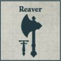

## Axiom Battleline Maniple

**COMPULSORY DETACHMENTS**

[{ width=100 height=100 }](../../factions/collegia_titanica/detachments.md#warlord-battle-titan-600-points) [{ width=100 height=100 }](../../factions/collegia_titanica/detachments.md#reaver-battle-titan-400-points) [{ width=100 height=100 }](../../factions/collegia_titanica/detachments.md#warhound-hunting-pack-300-points)

**OPTIONAL DETACHMENTS**

[{ width=100 height=100 }](../../factions/collegia_titanica/detachments.md#reaver-battle-titan-400-points) [{ width=100 height=100 }](../../factions/knight_households/detachments.md#knight-detachments) [{ width=100 height=100 }](../../factions/knight_households/detachments.md#knight-detachments)

---

## Lupercal Light Maniple

**COMPULSORY DETACHMENTS**

[{ width=100 height=100 }](../../factions/collegia_titanica/detachments.md#warhound-hunting-pack-300-points) [{ width=100 height=100 }](../../factions/collegia_titanica/detachments.md#warhound-hunting-pack-300-points)

**OPTIONAL DETACHMENTS**

[{ width=100 height=100 }](../../factions/collegia_titanica/detachments.md#dire-wolf-heavy-scout-titan-350-points) [{ width=100 height=100 }](../../factions/collegia_titanica/detachments.md#dire-wolf-heavy-scout-titan-350-points) [{ width=100 height=100 }](../../factions/knight_households/detachments.md#knight-detachments)

---

## Purgiatus Heavy Maniple

**COMPULSORY DETACHMENTS**

[{ width=100 height=100 }](../../factions/collegia_titanica/detachments.md#warmaster-heavy-battle-titan-850-points)

**OPTIONAL DETACHMENTS**

[{ width=100 height=100 }](../../factions/collegia_titanica/detachments.md#warmaster-heavy-battle-titan-850-points) [{ width=100 height=100 }](../../factions/collegia_titanica/detachments.md#warlord-battle-titan-600-points) [{ width=100 height=100 }](../../factions/collegia_titanica/detachments.md#warbringer-nemesis-titan-525-points) [{ width=100 height=100 }](../../factions/collegia_titanica/detachments.md#warbringer-nemesis-titan-525-points)

---

## Ruptura Battleline Maniple

**COMPULSORY DETACHMENTS**

[{ width=100 height=100 }](../../factions/collegia_titanica/detachments.md#warbringer-nemesis-titan-525-points) [{ width=100 height=100 }](../../factions/collegia_titanica/detachments.md#warbringer-nemesis-titan-525-points)

**OPTIONAL DETACHMENTS**

[{ width=100 height=100 }](../../factions/collegia_titanica/detachments.md#reaver-battle-titan-400-points) [{ width=100 height=100 }](../../factions/collegia_titanica/detachments.md#reaver-battle-titan-400-points) [{ width=100 height=100 }](../../factions/collegia_titanica/detachments.md#reaver-battle-titan-400-points) [{ width=100 height=100 }](../../factions/knight_households/detachments.md#knight-detachments)

---

## Ferrox Light Maniple

**COMPULSORY DETACHMENTS**

[{ width=100 height=100 }](../../factions/collegia_titanica/detachments.md#reaver-battle-titan-400-points) [{ width=100 height=100 }](../../factions/collegia_titanica/detachments.md#warhound-hunting-pack-300-points)

**OPTIONAL DETACHMENTS**

[{ width=100 height=100 }](../../factions/collegia_titanica/detachments.md#reaver-battle-titan-400-points) [{ width=100 height=100 }](../../factions/collegia_titanica/detachments.md#dire-wolf-heavy-scout-titan-350-points) [{ width=100 height=100 }](../../factions/knight_households/detachments.md#knight-detachments)

---

## Corsair Battleline Maniple

**COMPULSORY DETACHMENTS**

[{ width=100 height=100 }](../../factions/collegia_titanica/detachments.md#reaver-battle-titan-400-points) [{ width=100 height=100 }](../../factions/collegia_titanica/detachments.md#reaver-battle-titan-400-points)

**OPTIONAL DETACHMENTS**

[{ width=100 height=100 }](../../factions/collegia_titanica/detachments.md#reaver-battle-titan-400-points) [{ width=100 height=100 }](../../factions/collegia_titanica/detachments.md#reaver-battle-titan-400-points) [{ width=100 height=100 }](../../factions/collegia_titanica/detachments.md#reaver-battle-titan-400-points) [{ width=100 height=100 }](../../factions/knight_households/detachments.md#knight-detachments)
