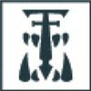
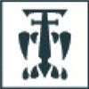
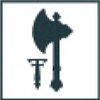
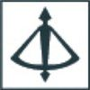
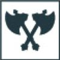
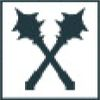

The following section presents the Collegia Titanica Army List, representing a Titan Legion deploying a demi-Legio or greater strength of titans to the battlefield, supported by Knight Banners. Within you'll find all the rules needed to build a Collegia Titanica Army.

**Designer’s Note: Collegia Titanica Army List**

The Collegia Titanica Army List presented over the following pages is intended as a thematic alternative Primary Army List. In Matched Play missions, they suffer from a lack of Objective control – with a Tactical Strength of 0, Titans will find it difficult to capture or contest Objectives – which makes achieving a conventional victory difficult. Allied Contingents mitigate this disadvantage to a degree and an Army of Titans and Knights is a destructive force, but the enemy will have a much easier time seizing and holding Objectives, making Victory Points easier to come by for them.

**Individual Detachment Roles**

Each Collegia Titanica Detachment is assigned a specific Detachment Role for the purpose of building a Collegia Titanica Army. They still fill the Titan Detachment role as well.

- Dire Wolf Heavy Scout Titan
- Warhound Hunting Pack
- Reaver Battle Titan
- Warbringer Nemesis Titan
- Warlord Battle Titan
- Warmaster Heavy Battle Titan and Warmaster Iconoclast Titan

*Note: This does not include Warlord-Sinister Battle Titans.*

**Titanic Pride**

Collegia Titanica Formations cannot be taken as part of an Allied Contingent.

**Strategic Asset Formation**

The rules for including Collegia Titanica Detachments in full Formations are presented on the following pages. In addition, Detachments from the Collegia Titanica Army List can be included in a Legio Support Strategic Asset Formation. This Formation can only be included in an Army as part of an Allied Contingent.

**Legio Support**

*The god-engines of the Collegia Titanica were terrifying weapons of war, each one capable of obliterating hordes of lesser enemies. Though it was not unheard of for a Titan Legio to be fielded in large numbers, it was more common for a small number of god-engines to be attached to other Imperial forces, lending their considerable might for the duration of a campaign.*

**Dire Wolf Heavy Scout Titan**

**Warhound Hunting Pack**

**Reaver Battle Titan**

**Warbringer Nemesis Titan**

**Warlord Battle Titan**

**Warmaster Heavy Battle Titan and Warmaster Iconoclast Titan**
