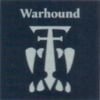
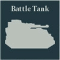
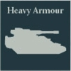
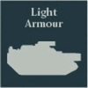
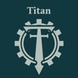
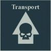

## Terror Protocol Cohort

**Command - Urgency:** When a Detachment in this Formation with the [Networked Anima] special rule is activated during the Movement phase, all models within it increase their Movement characteristic by 2" if the Detachment is within 6" of a model with the [Noosphere Controller] special rule. This effect lasts until the end of the round.

**Terror Protocol:** Compulsory Core Detachment slots in this Formation must be filled with Errax 'Butcher' Assault Stalker Cohort Detachments.

**COMPULSORY DETACHMENTS**

   

**OPTIONAL DETACHMENTS**

   

**One of the following:**

**OR**

---

## Purge Protocol Cohort

**Command - Exterminate:** Hits scored by a model with the [Noosphere Controller] special rule from this Formation mark the target Detachment until the end of the round. Models from this Formation with the [Networked Anima] special rule may re-roll Hit rolls of a 1 when firing upon a marked Detachment.

**COMPULSORY DETACHMENTS**

 

**OPTIONAL DETACHMENTS**

  

**One of the following:**

 

**OR**

 

---

## Swarm Protocol Cohort

**Swarm Protocol:** Compulsory Vanguard Detachment slots in this Formation must be filled with Harpax 'Swarmer' Scout Host Detachments.

Any Harpax 'Swarmer' Scout Host Detachment selected within a Compulsory Detachment slot may be upgraded to a 'Controller Host' for +15 points. A Detachment upgraded in this way gains the [Noosphere Controller] and [Invulnerable Save] (6+) special rules.

**Command - Overwhelm:** Harpax 'Swarmer' Scout Host Detachments within this Formation gain the [Infiltrate] special rule. All Detachments from this Formation with the [Networked Anima] special rule count their Scale as 1 higher for the purposes of determining if enemy Detachments are Engaged and Pinned while within 8" of a model from this Formation with the [Noosphere Controller] special rule.

*Note: This is only to determine if the enemy Detachment is Engaged and Pinned - the Harpax Swarms are still Engaged and Pinned by enemy Detachments of Scale (1).*

**COMPULSORY DETACHMENTS**

  

**OPTIONAL DETACHMENTS**

     

---

## Dark Taghma Sub-covenant

**Dedicated Transport:** Any Dark Mechanicum Detachment within the Formation that contains only Infantry or Walker models may be upgraded with Triaros Armoured Conveyors as Dedicated Transports.

**Augmented Thralls:** Compulsory Core Detachment slots in this Formation must be filled with Adsecularis Tech-thrall Covenant Detachments.

**COMPULSORY DETACHMENTS**

    

**OPTIONAL DETACHMENTS**

      

**One of the following:**

 

**One of the following:**

**OR**

 
