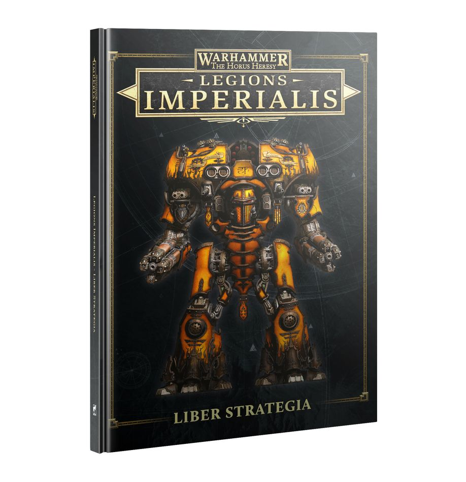

## LIBER STRATEGIA

This book contains Army Lists for each Army in Warhammer: The Horus Heresy - Legions Imperialis. Each Army List has been updated and revised to fully accommodate the breadth of Detachments available in this game, including a number which are brand new for this volume. It also contains a wealth of new material including updated Iconic Formations and Support Formations to supplement these Army Lists.

**How to Use This Book**

Each Army List has its own section in this book, presenting Formations and Datasheets for each Detachment available to that Army List, alongside any additional special rules that apply to those Detachments. The Army Lists contained within this book and the Formations and Detachments and special rules within them supersede any previous iterations found in the *Legions Imperialis Rulebook* or *The Great Slaughter, Devastation of Tallarn* and *Rise of the Dark Mechanicum* Campaign Books.

**Strategic Assets**

One of the main changes since the *Legions Imperialis Rulebook* was published is the addition of full Army Lists for the Collegia Titanica and Knight Households. As such, the rules for Strategic Assets on pages 198 and 205 of the *Legions Imperialis Rulebook* are superseded by those in this book and the appropriate Army List.

#### [Legiones Astartes](legiones_astartes/index.md)
#### [Solar Auxilia](solar_auxilia/index.md)
#### [Mechanicum Taghmata](mechanicum_taghmata/index.md)
#### [Dark Mechanicum](dark_mechanicum/index.md)
#### [Collegia Titanica](collegia_titanica/index.md)
#### [Knight Households](knight_households/index.md)

{ width=918 height=948 }
