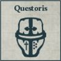
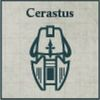
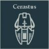
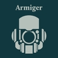
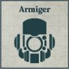
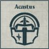

## Barony Guard Lance

**Seneschal:** After this Formation is deployed or after all deployment is finished, if the Formation is deployed in Reserve, choose one model that is part of a Compulsory Detachment to be upgraded to a Baron for free. A model upgraded in this way increases its CAF by +2 and its Wounds characteristic by 1.

**COMPULSORY DETACHMENTS**

  

**OPTIONAL DETACHMENTS**

   

---

## Vanguard Lance

**The Household's Spear:** All Detachments within this Formation gain the [Forward Deployment] special rule.

**COMPULSORY DETACHMENTS**

  

**OPTIONAL DETACHMENTS**

   

---

## Bastion Lance

**COMPULSORY DETACHMENTS**

  

**OPTIONAL DETACHMENTS**

  

---

## Bonded Household Lance

**Favoured by the Omnissiah:** Questoris Knight Detachment slots within this Formation must be filled with Questoris Mechanicum Knight Banner Detachments. Armiger Knight Detachment slots within this Formation must be filled with Mechanicum Knight Moirax Banner Detachments.

**COMPULSORY DETACHMENTS**

 

**OPTIONAL DETACHMENTS**

    
