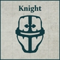

## Additional Rules

**Knightly Retainers:**
Models in Knight Armiger Talon and Mechanicum Knight Moirax Talon Detachments within a Knight Households Formation (excluding the Knightly Lance Strategic Asset Formation) have a Tactical Strength of 3 instead of 1.

**Knightly Pride:**
Knight Households Formations cannot be taken as part of an Allied Contingent.

**Detachment Roles**

Each Knight Households Detachment is also assigned a specific battlefield role for the purpose of building a Knight Households Army. They still fill the Knight Detachment role as well.

 **Questoris Knight Banner**

The following Detachments can be used to fill this Detachment role slot:

- Questoris Knight Banner
- Questoris Knight Banner
- Questoris Knight Banner

 **Cerastus Knight Banner**

The following Detachments can be used to fill this Detachment role slot:

- Cerastus Knight Banner
- Cerastus Knight Atrapos Banner

 **Acastus Knight Banner**

The following Detachments can be used to fill this Detachment role slot:

- Acastus Knight Porphyrion Banner
- Acastus Knight Asterius Banner

 **Armiger Knight Banner**

The following Detachments can be used to fill this Detachment role slot:

- Knight Armiger Talon
- Mechanicum Knight Moirax Talon

## Strategic Asset Formation

The rules for including Knight Households Detachments in full Formations are presented over the next few pages. In addition, Detachments from the Knight Households Army List can be included in a Knightly Lance Strategic Asset Formation. This Formation can only be included in an Army as part of an Allied Contingent.

**Knightly Lance**

**COMPULSORY DETACHMENTS**

{ width=100 height=100 }

**Paragons of Duty:** Each Knight model within this Formation that has the Independent special rule always forms its own Independent Unit, even if there are several models within a Detachment that have the same name.

*For Example: A Questoris Knight Banner Detachment consists of one Knight Errant and two Knight Paladin models. As such the Detachment is formed of three Independent Units: a Knight Errant, a Knight Paladin and a Knight Paladin.*
