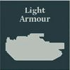
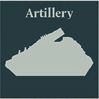
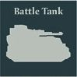
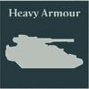

## Legion Demi-Company

**Dedicated Transports:** Any Legiones Astartes Detachment within the Formation that contains only Infantry models may be upgraded with [Legion Rhinos](detachments.md#legion-rhino-detachment-10-points-per-model) as Dedicated Transports.

**Heart of the Legion:** Compulsory Core Detachment slots in this Formation must be filled with [Legion Tactical](detachments.md#legion-tactical-detachment-35-points) Detachments. All non-Infantry models within this Formation increase their Tactical Strength by 1 when contesting an Objective marker that an Infantry model within this Formation is also contesting.

**COMPULSORY DETACHMENTS**

   

**OPTIONAL DETACHMENTS**

      

**One of the following:**

 

**One of the following:**

  

---

## Legion Garrison Force

**COMPULSORY DETACHMENTS**

   

**OPTIONAL DETACHMENTS**

      

**One of the following:**

 

---

## Legion Armoured Company

**Armoured Command:** HQ Detachment slots in this Formation must be filled by Legion Predator Commander, Legion Sicaran Commander or Legion Kratos Commander Detachments.

**COMPULSORY DETACHMENTS**

   

**OPTIONAL DETACHMENTS**

   

**One of the following:**

 

---

## Legion Aerial Assault

**Dedicated Transports:** Any Legiones Astartes Detachment within a Legion Aerial Assault Formation can be upgraded with [Legion Storm Eagles](detachments.md#legion-storm-eagle-squadron-85-points) or [Legion Thunderhawks](detachments.md#legion-thunderhawk-gunship-150-points) as Dedicated Transports, at a cost of +85 points per Legion Storm Eagle and +150 points per Legion Thunderhawk.

**Aerial Assault:** All Detachments within the Formation that do not have the Flyer special rule must begin the game Embarked upon a Transport with the Flyer special rule.

**COMPULSORY DETACHMENTS**

   

**OPTIONAL DETACHMENTS**

     

---

## Legion Sky-Hunter Phalanx

**Rapid Reaction Force:** Compulsory Vanguard Detachment slots in this Formation must be filled with [Legion Scimitar Jetbike Squadron](detachments.md#legion-scimitar-jetbike-squadron-35-points), [Legion Land Speeder Squadron](detachments.md#legion-land-speeder-squadron-30-points) or [Legion Javelin Squadron](detachments.md#legion-javelin-squadron-35-points) Detachments.

**Swift Assault:** All Legion Scimitar Jetbike Squadron, Legion Land Speeder Squadron or Legion Javelin Squadron Detachments in this Formation gain the [Outflank] special rule.

**COMPULSORY DETACHMENTS**

   

**OPTIONAL DETACHMENTS**

   

---

## Legion Drop Pod Assault

**Dedicated Transports:** All Legiones Astartes Detachments within the Formation that contain only Infantry models (excluding models with the Deep Strike special rule) must be upgraded with [Legion Drop Pods](detachments.md#legion-drop-pod-detachment-10-points-per-model) as Dedicated Transports, and all Legiones Astartes Detachments within the Formation that contain only Walker models (excluding models with the Deep Strike special rule) must be upgraded with [Dreadnought Drop Pods](detachments.md#dreadnought-drop-pod-detachment-12-points-per-model) as Dedicated Transports.

All Detachments within this Formation that are upgraded with Dedicated Transports must start the battle deployed within them.

**COMPULSORY DETACHMENTS**

   

**OPTIONAL DETACHMENTS**

    

---

## Legion Heavy Assault Spearhead

**Heavy Assault:** At least two Compulsory Support Detachment slots in this Formation must be filled with [Legion Terminator](detachments.md#legion-terminator-detachment-50-points) Detachments. Any remaining Compulsory Support Detachment slots in this Formation must be filled with Legion Terminator Detachments, [Legion Contemptor Dreadnought Talons](detachments.md#legion-contemptor-dreadnought-talon-70-points) or [Leviathan Siege Dreadnoughts](detachments.md#leviathan-siege-dreadnought-detachment-75-points).

**Dedicated Transports:** All Legiones Astartes Detachments within this Formation that contain only Infantry models must be upgraded with [Legion Spartans](detachments.md#legion-spartan-detachment-70-points-per-model) or [Legion Land Raiders](detachments.md#legion-land-raider-detachment-35-points-per-model) as Dedicated Transports.

**COMPULSORY DETACHMENTS**

   

**OPTIONAL DETACHMENTS**

    

---

## Legion Subterranean Assault

**Dedicated Transports:** All Legiones Astartes Detachments within this Formation that contain only Infantry models (excluding models with the Deep Strike special rule) must be upgraded with [Legion Termites](detachments.md#legion-termite-detachment-14-points-per-model) as Dedicated Transports.

**Subterranean Assault:** When a Detachment from this Formation that has been upgraded with Legion Termites as Dedicated Transports Deep Strikes, after placing and scattering the initial model, roll a D6 for each enemy Detachment with a Scale of 2 or less that is within 6" of that initial model. On a 5+, that enemy Detachment suffers the effects of the [Quake] trait as if a hit had been scored against it by a weapon with that trait.

**COMPULSORY DETACHMENTS**

   

**OPTIONAL DETACHMENTS**

   
