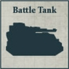
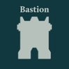
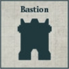

## Legio Cybernetica Cohort

**Legio Cybernetica:** All slots within this Formation, apart from Core, Transport, and Titan slots, must be filled with Detachments that have either the [Cortex Controller] or [Cybernetica Cortex] (X) special rule. The range of the Cortex Controller special rule's effects for all models within the Formation is 12" instead of 8".

**COMPULSORY DETACHMENTS**

[{ width=100 height=100 }](../../factions/mechanicum_taghmata/detachments.md#hq-detachments) [{ width=100 height=100 }](../../factions/mechanicum_taghmata/detachments.md#core-detachments) [{ width=100 height=100 }](../../factions/mechanicum_taghmata/detachments.md#support-detachments) [{ width=100 height=100 }](../../factions/mechanicum_taghmata/detachments.md#support-detachments)

**OPTIONAL DETACHMENTS**

[{ width=99 height=99 }](../../factions/mechanicum_taghmata/detachments.md#hq-detachments) [{ width=99 height=99 }](../../factions/mechanicum_taghmata/detachments.md#hq-detachments) [{ width=99 height=99 }](../../factions/mechanicum_taghmata/detachments.md#support-detachments) [{ width=99 height=99 }](../../factions/mechanicum_taghmata/detachments.md#vanguard-detachments) [{ width=99 height=99 }](../../factions/mechanicum_taghmata/detachments.md#core-detachments) [{ width=99 height=99 }](../../factions/mechanicum_taghmata/detachments.md#core-detachments) [{ width=100 height=100 }](detachments.md#transport-detachments) [{ width=100 height=100 }](detachments.md#transport-detachments)

**One of the following:**

[{ width=99 height=99 }](../../factions/mechanicum_taghmata/detachments.md#support-detachments) [{ width=99 height=99 }](../../factions/mechanicum_taghmata/detachments.md#support-detachments)

**OR**

[{ width=99 height=99 }](../../factions/mechanicum_taghmata/detachments.md#vanguard-detachments) [{ width=99 height=99 }](../../factions/mechanicum_taghmata/detachments.md#vanguard-detachments)

[{ width=99 height=99 }](../../factions/collegia_titanica/detachments.md#titan-detachments)

---

## Autokratorii Regiment

**Cortex Controller:** One Vehicle model from a Compulsory Detachment may be upgraded with the [Cortex Controller] special rule for +10 points.

**COMPULSORY DETACHMENTS**

[{ width=100 height=100 }](../../factions/mechanicum_taghmata/detachments.md#battle-tank-detachments) [{ width=100 height=100 }](../../factions/mechanicum_taghmata/detachments.md#battle-tank-detachments) [{ width=100 height=100 }](../../factions/mechanicum_taghmata/detachments.md#battle-tank-detachments)

**OPTIONAL DETACHMENTS**

[{ width=99 height=99 }](../../factions/mechanicum_taghmata/detachments.md#hq-detachments) [{ width=99 height=99 }](../../factions/mechanicum_taghmata/detachments.md#support-detachments) [{ width=100 height=100 }](detachments.md#transport-detachments) [{ width=99 height=99 }](../../factions/mechanicum_taghmata/detachments.md#support-detachments) [{ width=99 height=99 }](../../factions/mechanicum_taghmata/detachments.md#support-detachments) [{ width=100 height=100 }](detachments.md#transport-detachments) [{ width=100 height=100 }](../../factions/mechanicum_taghmata/detachments.md#battle-tank-detachments)

**One of the following:**

[{ width=99 height=99 }](../../factions/collegia_titanica/detachments.md#titan-detachments)

**OR**

[{ width=99 height=99 }](../../factions/knight_households/detachments.md#knight-detachments) [{ width=99 height=99 }](../../factions/knight_households/detachments.md#knight-detachments)

---

## Taghma Sub-Covenant

**Dedicated Transports:** Detachments within this Formation that contain only Infantry or Walker models may be upgraded with Triaros Armoured Conveyors as Dedicated Transports.

**Servants of the Lacrymaerta:** Compulsory Core Detachment slots in this Formation must be filled with Adsecularis Tech-thrall Covenant Detachments.

**COMPULSORY DETACHMENTS**

[{ width=100 height=100 }](../../factions/mechanicum_taghmata/detachments.md#hq-detachments) [{ width=100 height=100 }](../../factions/mechanicum_taghmata/detachments.md#core-detachments) [{ width=100 height=100 }](../../factions/mechanicum_taghmata/detachments.md#core-detachments) [{ width=100 height=100 }](../../factions/mechanicum_taghmata/detachments.md#support-detachments) [{ width=100 height=100 }](../../factions/mechanicum_taghmata/detachments.md#support-detachments)

**OPTIONAL DETACHMENTS**

[{ width=99 height=99 }](../../factions/mechanicum_taghmata/detachments.md#hq-detachments) [{ width=99 height=99 }](../../factions/mechanicum_taghmata/detachments.md#core-detachments) [{ width=99 height=99 }](../../factions/mechanicum_taghmata/detachments.md#support-detachments) [{ width=99 height=99 }](../../factions/mechanicum_taghmata/detachments.md#bastion-detachments) [{ width=99 height=99 }](../../factions/mechanicum_taghmata/detachments.md#vanguard-detachments) [{ width=100 height=100 }](../../factions/mechanicum_taghmata/detachments.md#battle-tank-detachments) [{ width=100 height=100 }](detachments.md#transport-detachments)

**One of the following:**

[{ width=99 height=99 }](../../factions/collegia_titanica/detachments.md#titan-detachments)

**OR**

[{ width=99 height=99 }](../../factions/knight_households/detachments.md#knight-detachments) [{ width=99 height=99 }](../../factions/knight_households/detachments.md#knight-detachments)

---

## Ordo Reductor Subdivision

**COMPULSORY DETACHMENTS**

[{ width=100 height=100 }](../../factions/mechanicum_taghmata/detachments.md#hq-detachments) [{ width=100 height=100 }](../../factions/mechanicum_taghmata/detachments.md#support-detachments) [{ width=100 height=100 }](../../factions/mechanicum_taghmata/detachments.md#bastion-detachments) [{ width=100 height=100 }](../../factions/mechanicum_taghmata/detachments.md#bastion-detachments)

**OPTIONAL DETACHMENTS**

[{ width=99 height=99 }](../../factions/mechanicum_taghmata/detachments.md#hq-detachments) [{ width=99 height=99 }](../../factions/mechanicum_taghmata/detachments.md#support-detachments) [{ width=99 height=99 }](../../factions/mechanicum_taghmata/detachments.md#support-detachments) [{ width=99 height=99 }](../../factions/mechanicum_taghmata/detachments.md#bastion-detachments) [{ width=100 height=100 }](../../factions/mechanicum_taghmata/detachments.md#battle-tank-detachments)

**One of the following:**

[{ width=99 height=99 }](../../factions/collegia_titanica/detachments.md#titan-detachments)

**OR**

[{ width=100 height=100 }](../../factions/knight_households/detachments.md#acastus-knight-asterius-banner-240-points)

---

## Myrmidax Conclave

**Cult of Destruction:** Support Detachment slots within this Formation must be filled with Myrmidon Secutor Host or Myrmidon Destructor Host Detachments.

**COMPULSORY DETACHMENTS**

[{ width=100 height=100 }](../../factions/mechanicum_taghmata/detachments.md#hq-detachments) [{ width=100 height=100 }](../../factions/mechanicum_taghmata/detachments.md#support-detachments) [{ width=100 height=100 }](../../factions/mechanicum_taghmata/detachments.md#support-detachments) [{ width=100 height=100 }](../../factions/mechanicum_taghmata/detachments.md#support-detachments)

**OPTIONAL DETACHMENTS**

[{ width=99 height=99 }](../../factions/mechanicum_taghmata/detachments.md#hq-detachments) [{ width=100 height=100 }](detachments.md#transport-detachments) [{ width=99 height=99 }](../../factions/mechanicum_taghmata/detachments.md#support-detachments) [{ width=99 height=99 }](../../factions/mechanicum_taghmata/detachments.md#support-detachments)
