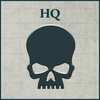

## Solar Auxilia Sub-Cohort

**Disciplined Ranks**: Compulsory Core Detachment slots within this Formation must be filled with Auxilia Lasrifle Tercio Detachments.

**COMPULSORY DETACHMENTS**

   

**OPTIONAL DETACHMENTS**

      

**One of the following:**

 

**One of the following:**

  

---

## Solar Auxilia Armoured Company

**Tank Commander**: One Vehicle model from a Compulsory Detachment must be upgraded to a Tank Commander for [+10 points] (see page 74).

**COMPULSORY DETACHMENTS**

  

**OPTIONAL DETACHMENTS**

  

**One of the following:**

  

---

## Solar Auxilia Pioneer Company

**Forward Positions**:  Compulsory Support Detachment slots in this Formation must be filled with Auxilia Veletaris Storm Sections.
All Solar Auxilia Detachments within a Solar Auxilia Pioneer Company that consist entirely of Infantry models without the Bulky special rule gain the Infiltrate special rule. All other Solar Auxilia Detachments within the Solar Auxilia Pioneer Company gain the Forward Deployment special rule.

**COMPULSORY DETACHMENTS**

   

**OPTIONAL DETACHMENTS**

    

**One of the following:**

  

---

## Solar Auxilia Artillery Company

**Pulverising Volleys**: Earthshaker cannon and Medusa siege guns that models in this Formation are equipped with do not suffer a –1 penalty to all Hit rolls when firing against a target they cannot draw line of sight to.

**COMPULSORY DETACHMENTS**

   

**OPTIONAL DETACHMENTS**

   

---

## Solar Auxilia Mechanised Infantry Sub-Cohort

**Dedicated Transports**: All Solar Auxilia Detachments within the Formation that contain only Infantry models (excluding models with the Deep Strike special rule) must be upgraded with Dracosans as Dedicated Transports.

**COMPULSORY DETACHMENTS**

   

**OPTIONAL DETACHMENTS**

   

---

## Solar Auxilia Super-Heavy Company

**Tank Commander**: One Super-heavy Vehicle model from a Compulsory Detachment must be upgraded to a Tank Commander for +10 points (see page 74).

**Mobile Fortifications**: While two or more models from this Formation are within range of the same Objective marker, increase the Tactical Strength of each model from this Formation that is within range of that Objective marker by 1 when determining which player captures that Objective marker.

**COMPULSORY DETACHMENTS**

  

**OPTIONAL DETACHMENTS**

 

---

## Solar Auxilia Titan Hunter Company

**Tank Commander**: One Vehicle model from a Compulsory Detachment must be upgraded to a Tank Commander for +10 points (see page 74).

**Titan Hunters**:  Compulsory Heavy Armour Detachment slots in this Formation must be filled with Auxilia Shadowsword Detachments.
If an Auxilia Shadowsword Detachment from this Formation that is issued with a First Fire Order is firing at a Titan Detachment, volcano cannon that models in the Auxilia Shadowsword Detachment are equipped with are treated as having the Accurate weapon trait.

**COMPULSORY DETACHMENTS**

  

**OPTIONAL DETACHMENTS**

 

---

## Solar Auxilia Leman Russ Spearhead

**Armoured Company**: Battle Tank Detachment slots in this Formation must be filled with Leman Russ Strike Squadrons, Leman Russ Vanquisher Squadrons, Leman Russ Executioner Squadrons, Leman Russ Demolisher Squadrons, Leman Russ Annihilator Squadrons or Leman Russ Exterminator Squadrons.

**Tank Commander**: One Vehicle model from a Compulsory Detachment must be upgraded to a Tank Commander for +10 points (see page 74).

**COMPULSORY DETACHMENTS**

  

**OPTIONAL DETACHMENTS**

   
