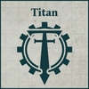

## Collegia Titanica Support Cohorts

**SUPPORT FORMATION: COLLEGIA TITANICA**

**Bound Taghma:** All slots within this Support Formation, apart from Titan Detachment slots, must be filled by Detachments taken from the Mechanicum Taghmata Army List. Non-Core Detachments taken from the Mechanicum Taghmata Army List must have the Cybernetica Cortex (X) special rule.

All Titan Detachments within this Support Formation gain the Cortex Controller special rule. A Titan model from this Support Formation counts its Tactical Strength as equal to its remaining Wounds while within 3" of a non-Titan Detachment from this Support Formation.

**COMPULSORY DETACHMENTS**

[{ width=100 height=100 }](../../factions/collegia_titanica/detachments.md#titan-detachments) [{ width=100 height=100 }](../../factions/mechanicum_taghmata/detachments.md#support-detachments) [{ width=100 height=100 }](../../factions/mechanicum_taghmata/detachments.md#support-detachments)

**OPTIONAL DETACHMENTS**

[{ width=99 height=99 }](../../factions/mechanicum_taghmata/detachments.md#core-detachments) [{ width=99 height=99 }](../../factions/mechanicum_taghmata/detachments.md#core-detachments) [{ width=99 height=99 }](../../factions/collegia_titanica/detachments.md#titan-detachments) [{ width=99 height=99 }](../../factions/collegia_titanica/detachments.md#titan-detachments)

**One of the following:**

[{ width=99 height=99 }](../../factions/mechanicum_taghmata/detachments.md#support-detachments) [{ width=99 height=99 }](../../factions/mechanicum_taghmata/detachments.md#support-detachments)

**OR**

[{ width=99 height=99 }](../../factions/mechanicum_taghmata/detachments.md#bastion-detachments) [{ width=99 height=99 }](../../factions/mechanicum_taghmata/detachments.md#bastion-detachments)

---