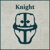

## Knight Household Retainer Cohorts

**SUPPORT FORMATION: KNIGHT HOUSEHOLDS**

**Household Vanguard:** All Vanguard Detachment slots within this Support Formation must be filled by Detachments taken from the Mechanicum Taghmata Army List. Detachments taken from the Mechanicum Taghmata Army List must have the Cybernetica Cortex (X) special rule.

- If all Compulsory Vanguard Detachment slots are filled with Vorax Battle-automata Maniple Detachments, then all Knight Detachments in this Support Formation gain the [Forward Deployment] special rule.
- If all Compulsory Vanguard Detachment slots are filled with Vultarax Stratos-automata Squadron Detachments, then all Knight Detachments in this Support Formation gain the [Outflank] special rule.

All Questoris Knight Banner and Cerastus Knight Banner Detachments within this Support Formation gain the Cortex Controller special rule.

**COMPULSORY DETACHMENTS**

  

**OPTIONAL DETACHMENTS**

      

---

## Knight Household Aegis Cohorts

**SUPPORT FORMATION: KNIGHT HOUSEHOLDS**

**Inducted Automata:** All slots within this Support Formation, apart from Knight Detachment slots, must be filled by Detachments taken from the Mechanicum Taghmata Army List. Detachments taken from the Mechanicum Taghmata Army List must have the Cybernetica Cortex (X) special rule.

All Knight Detachments within this Support Formation gain the Cortex Controller special rule.

**COMPULSORY DETACHMENTS**

  

**OPTIONAL DETACHMENTS**

    

---