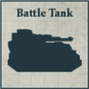

## Demi-Maniple Aeterna

**ICONIC FORMATION: COLLEGIA TITANICA**

**STANDARD DETACHMENTS: 780 Points**

[{ width=100 height=100 }](../../factions/collegia_titanica/detachments.md#reaver-battle-titan-400-points)

* **Reaver Battle Titan**

1 Reaver Battle Titan model equipped with Reaver volcano cannon, Reaver gatling blaster and Reaver vulcan mega-bolter.

[{ width=100 height=100 }](../../factions/knight_households/detachments.md#questoris-knight-banner-130-points)

* **Questoris Knight Banner**

1 Knight Errant and 1 Knight Gallant models. These models are equipped with rocket pods.

[{ width=100 height=100 }](../../factions/mechanicum_taghmata/detachments.md#krios-venator-squadron-60-points)

* **Krios Venator Squadron**

6 Krios Venator models.

**EXPANDED DETACHMENTS: +960 Points**

[{ width=100 height=100 }](../../factions/knight_households/detachments.md#cerastus-knight-banner-160-points)

* **Cerastus Knight Banner**

2 Knight Lancer models.

[{ width=100 height=100 }](../../factions/mechanicum_taghmata/detachments.md#vultarax-stratos-automata-squadron-35-points)

* **Vultarax Stratos-automata Squadron**

4 Vultarax models.

[{ width=100 height=100 }](../../factions/collegia_titanica/detachments.md#warhound-hunting-pack-300-points)

* **Warhound Hunting Pack**

2 Warhound Titan models. One model is equipped with plasma blastgun and vulcan mega-bolter and the other is equipped with volkite eradicator and vulcan mega-bolter.

**Defenders of Magma City:** This Formation can only be included in an Army with the Loyalist Allegiance. In addition, an Army can only include one Demi-Maniple Aeterna Formation.

**Children of the Storm:** Once per game, when a Titan from this Formation finishes its activation during the Combat phase, it may immediately fire one of its weapons again.
