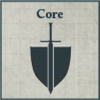
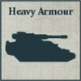

## Sibilians Taghma

**ICONIC FORMATION: DARK MECHANICUM**

**STANDARD DETACHMENTS: 900 Points**

[{ width=100 height=100 }](../../factions/dark_mechanicum/detachments.md#scintillax-cyclops-noospheric-stalker-network-75-points)

* **Scintillax 'Cyclops' Noospheric Stalker Network**

4 Scintillax models. These models are equipped with storm lasers.

[{ width=100 height=100 }](../../factions/dark_mechanicum/detachments.md#adsecularis-tech-thrall-covenant-40-points)

* **Asdecularis Tech-thrall Covenant**

10 Tech-thrall models.

[{ width=100 height=100 }](../../factions/dark_mechanicum/detachments.md#adsecularis-tech-thrall-covenant-40-points)

* **Asdecularis Tech-thrall Covenant**

10 Tech-thrall models.

[{ width=100 height=100 }](../../factions/dark_mechanicum/detachments.md#serperos-overlord-heavy-stalker-maniple-175-points)

* **Serperos 'Overlord' Heavy Stalker Maniple**

6 Serperos models. These models are equipped with exo-planar bombards and irradiation engines.

[{ width=100 height=100 }](../../factions/dark_mechanicum/detachments.md#myrmidon-secutor-host-30-points)

* **Myrmidon Secutor Host**

6 Myrmidon Secutor models.

This Detachment has 2 [Triaros](../../factions/dark_mechanicum/detachments.md#triaros-armoured-conveyor-22-points-per-model) models as Dedicated Transports.

**EXPANDED DETACHMENTS: +700 Points**

[{ width=100 height=100 }](../../factions/dark_mechanicum/detachments.md#adsecularis-tech-thrall-covenant-40-points)

* **Asdecularis Tech-thrall Covenant**

10 Tech-thrall models.

[{ width=100 height=100 }](../../factions/dark_mechanicum/detachments.md#myrmidon-secutor-host-30-points)

* **Myrmidon Secutor Host**

6 Myrmidon Secutor models.

This Detachment has 2 [Triaros](../../factions/dark_mechanicum/detachments.md#triaros-armoured-conveyor-22-points-per-model) models as Dedicated Transports.

[{ width=100 height=100 }](../../factions/dark_mechanicum/detachments.md#serperos-overlord-heavy-stalker-maniple-175-points)

* **Serperos 'Overlord' Heavy Stalker Maniple**

6 Serperos models. These models are equipped with exo-planar bombards and irradiation engines.

**Servants of Kelbor-Hal:** This Formation can only be included in an Army with the Traitor Allegiance.

**Protocol - Scourge:** While a Detachment from this Formation with the [Networked Anima] special rule is within 8" of a model with the Noospheric Controller special rule from this Formation, all models in that Detachment increase the range of their weapons by 4".
