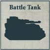
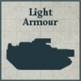

## Iron Hands Seeker-Killer Clave Ultor

**ICONIC FORMATION: LEGIONES ASTARTES**

**STANDARD DETACHMENTS: 410 Points**

* **Legion Sicaran Squadron**

4 Legion Sicaran models. These models are equipped with Sponson Mounted lascannon.

* **Legion Sicaran Omega Squadron**

4 Legion Sicaran Omega models. These models are equipped with Sponson Mounted lascannon.

* **Legion Sabre Squadron**

4 Sabre models. These models are equipped with Hull Mounted neutron blaster and Hull Mounted multi-melta.

**EXPANDED DETACHMENTS: +260 Points**

* **Legion Sicaran Squadron**

4 Legion Sicaran models. These models are equipped with Sponson Mounted lascannon.

* **Legion Sabre Squadron**

4 Sabre models. These models are equipped with Hull Mounted neutron blaster and Hull Mounted multi-melta.

**Sons of Ferrus Manus:** This Formation must be from the [Iron Hands Legion](../../factions/legiones_astartes/special_rules.md#the-xth-legion-iron-hands) and can only be included in an Army with the Loyalist Allegiance. In addition, an Army can only include one Iron Hands Seeker-Killer Clave Ultor Formation.

**Seeker-killers:** Detachments from this Formation have the [Macro-extinction Targeting Protocols] special rule.

---

## Iron Warriors Proioxis Macro-Assault Wing

**ICONIC FORMATION: LEGIONES ASTARTES**

**STANDARD DETACHMENTS: 340 Points**

* **Legion Terminator Detachment**

4 Legion Terminator models.

This Detachment has 2 [Spartan](../../factions/legiones_astartes/detachments.md#legion-spartan-detachment-70-points-per-model) models as Dedicated Transports. These Spartan models are equipped with Sponson Mounted quad lascannon and Hull Mounted lascannon.

* **Legion Terminator Detachment**

4 Legion Terminator models.

This Detachment has 2 [Spartan](../../factions/legiones_astartes/detachments.md#legion-spartan-detachment-70-points-per-model) models as Dedicated Transports. These Spartan models are equipped with Sponson Mounted quad lascannon and Hull Mounted lascannon.

**EXPANDED DETACHMENTS: +410 Points**

* **Legion Terminator Detachment**

4 Legion Terminator models.

This Detachment has 2 [Spartan](../../factions/legiones_astartes/detachments.md#legion-spartan-detachment-70-points-per-model) models as Dedicated Transports. These Spartan models are equipped with Sponson Mounted quad lascannon and Hull Mounted lascannon.

* **Legion Kratos Squadron**

3 Legion Kratos models. These models are equipped with Kratos battlecannon, Kratos lascannon and Sponson Mounted lascannon.

**Sons of Perturabo:** This Formation must be from the [Iron Warriors Legion](../../factions/legiones_astartes/special_rules.md#the-ivth-legion-iron-warriors) and can only be included in an Army with the Traitor Allegiance. In addition, an Army can only include one Iron Warriors Proioxis Macro-Assault Wing Formation.

**Hammerblow Assault:** Legion Terminator models from this Formation increase their CAF by 2 during any round in which they Disembarked from a Spartan model from this Formation.

---

## Alpha Legion Harrow Group Arcadus

**ICONIC FORMATION: LEGIONES ASTARTES**

**STANDARD DETACHMENTS: 495 Points**

* **Legion Sicaran Punisher Squadron**

4 Sicaran Punisher models. These models are equipped with Sponson Mounted heavy bolters.

* **Legion Sicaran Punisher Squadron**

4 Sicaran Punisher models. These models are equipped with Sponson Mounted heavy bolters.

* **Legion Plasma Gun Support Detachment**

8 Support Legionaries models.

This Detachment has 4 [Land Raider](../../factions/legiones_astartes/detachments.md#legion-land-raider-detachment-35-points-per-model) models as Dedicated Transports. One Land Raider model is equipped with a Pintle Mounted multi-melta.

**EXPANDED DETACHMENTS: +300 Points**

* **Legion Sabre Squadron**

4 Sabre models. These models are equipped with Hull Mounted Anvilus autocannon and Hull Mounted heavy bolter.

* **Legion Plasma Gun Support Detachment**

8 Support Legionaries models.

This Detachment has 4 [Land Raider](../../factions/legiones_astartes/detachments.md#legion-land-raider-detachment-35-points-per-model) models as Dedicated Transports. One Land Raider model is equipped with a Pintle Mounted multi-melta.

**Protean Instrument:** This Formation must be from the [Alpha Legion](../../factions/legiones_astartes/special_rules.md#the-xxth-legion-alpha-legion). In addition, an Army can only include one Alpha Legion Harrow Group Arcadus Formation.

**Obfuscation Protocols:** Detachments from this Formation have the [Outflank] and [Scout] special rules.

---

## Legion Tactical Strike Force

**ICONIC FORMATION: LEGIONES ASTARTES**

**STANDARD DETACHMENTS: 230 Points**

* **Legion Command Detachment**

1 Command Squad model.

This Detachment has 1 [Rhino](../../factions/legiones_astartes/detachments.md#legion-rhino-detachment-10-points-per-model) model as a Dedicated Transport. That Rhino model is equipped with a Pintle Mounted multi-melta.

* **Legion Tactical Detachment**

8 Tactical Legionaries models. One model has an Apothecary.

This Detachment has 4 [Rhino](../../factions/legiones_astartes/detachments.md#legion-rhino-detachment-10-points-per-model) models as Dedicated Transports.

* **Legion Tactical Detachment**

8 Tactical Legionaries models. One model has an Apothecary.

This Detachment has 4 [Rhino](../../factions/legiones_astartes/detachments.md#legion-rhino-detachment-10-points-per-model) models as Dedicated Transports.

**EXPANDED DETACHMENTS: +140 Points**

* **Legion Plasma Gun Support Detachment**

4 Support Legionaries models.

This Detachment has 2 [Rhino](../../factions/legiones_astartes/detachments.md#legion-rhino-detachment-10-points-per-model) models as Dedicated Transports. Both Rhino models are equipped with a Pintle Mounted havoc launcher.

* **Legion Missile Launcher Support Detachment**

4 Heavy Support Legionaries models.

This Detachment has 2 [Rhino](../../factions/legiones_astartes/detachments.md#legion-rhino-detachment-10-points-per-model) models as Dedicated Transports.

* **Legion Assault Detachment**

4 Assault Legionaries models.

**Officer of the Line:** The Command Squad model in this Formation can use the [Master Tactician] special rule once when it is activated, but if it does, both Detachments selected to have their Order replaced must be from this Formation.

**Backbone of the Legion:** Legion Tactical Detachments from this Formation have the [Line] special rule.

---

## Legion Speartip Assault

**ICONIC FORMATION: LEGIONES ASTARTES**

**STANDARD DETACHMENTS: 230 Points**

* **Legion Command Detachment**

1 Command Squad model.

This Detachment has 1 [Drop Pod](../../factions/legiones_astartes/detachments.md#legion-drop-pod-detachment-10-points-per-model) model as a Dedicated Transport.

* **Legion Tactical Detachment**

4 Tactical Legionaries models, 2 Plasma Gun Support models and 2 Missile Launcher Support models. One Tactical Legionaries model has an Apothecary.

This Detachment has 4 [Drop Pod](../../factions/legiones_astartes/detachments.md#legion-drop-pod-detachment-10-points-per-model) models as Dedicated Transports.

* **Legion Tactical Detachment**

4 Tactical Legionaries models, 2 Plasma Gun Support models and 2 Missile Launcher Support models. One Tactical Legionaries model has an Apothecary.

This Detachment has 4 [Drop Pod](../../factions/legiones_astartes/detachments.md#legion-drop-pod-detachment-10-points-per-model) models as Dedicated Transports.

* **Legion Palisade Drop Pod**

1 Palisade Drop Pod model.

**EXPANDED DETACHMENTS: +205 Points**

* **Leviathan Siege Dreadnought Talon**

4 Leviathan Dreadnought models. These models are equipped with cyclonic melta lances.

This Detachment has 4 [Dreadnought Drop Pod](../../factions/legiones_astartes/detachments.md#dreadnought-drop-pod-detachment-12-points-per-model) models as Dedicated Transports.

* **Legion Contemptor Dreadnought Talon**

4 Contemptor Dreadnought models. These models are equipped with twin-linked lascannon.

This Detachment has 4 [Dreadnought Drop Pod](../../factions/legiones_astartes/detachments.md#dreadnought-drop-pod-detachment-12-points-per-model) models as Dedicated Transports.

* **Legion Palisade Drop Pod**

1 Palisade Drop Pod model.

**Tip of the Spear:** All Detachments in this Formation must start the battle deployed within their Dedicated Transports. When a Detachment from this Formation Deep Strikes, after placing the first model, that model does not Scatter.

---

## Legion Stonebreaker Siege Force

**ICONIC FORMATION: LEGIONES ASTARTES**

**STANDARD DETACHMENTS: 370 Points**

* **Legion Command Detachment**

1 Command Squad model.

This Detachment has 1 [Land Raider](../../factions/legiones_astartes/detachments.md#legion-land-raider-detachment-35-points-per-model) model as a Dedicated Transport. That Land Raider model is equipped with a Pintle Mounted multi-melta.

* **Legion Tactical Detachment**

8 Tactical Legionaries models. One model has an Apothecary.

This Detachment has 4 [Land Raider](../../factions/legiones_astartes/detachments.md#legion-land-raider-detachment-35-points-per-model) models as Dedicated Transports.

* **Legion Vindicator Squadron**

4 Vindicator models.

**EXPANDED DETACHMENTS: +520 Points**

* **Legion Whirlwind Battery**

6 Whirlwind models.

* **Legion Terminator Detachment**

6 Legion Terminator models.

This Detachment has 6 [Land Raider](../../factions/legiones_astartes/detachments.md#legion-land-raider-detachment-35-points-per-model) models as Dedicated Transports.

* **Legion Vindicator Squadron**

4 Vindicator models.

**Shattering Barrage:** When making a Fight roll for an enemy model that is Garrisoned within a Structure that is in a Fight against an Infantry model from this Formation, the controlling player does not gain the Structure Bonus to that model's CAF if that Structure has lost any Wounds.

---

## Death Guard Reaping Host

**ICONIC FORMATION: LEGIONES ASTARTES**

**STANDARD DETACHMENTS: 285 Points**

* **Legion Command Detachment**

1 Command Squad model.

* **Legion Missile Launcher Support Detachment**

8 Heavy Support Legionaries models.

* **Legion Terminator Detachment**

4 Legion Terminator models.

This Detachment has 2 [Spartan](../../factions/legiones_astartes/detachments.md#legion-spartan-detachment-70-points-per-model) models as Dedicated Transports. These Spartan models are equipped with Sponson Mounted laser destroyers and Hull Mounted lascannon.

**EXPANDED DETACHMENTS: +350 Points**

* **Legion Missile Launcher Support Detachment**

4 Heavy Support Legionaries models.

* **Legion Rapier Battery**

4 Legion Rapier models. These models are equipped with quad launchers.

* **Legion Rapier Battery**

4 Legion Rapier models. These models are equipped with quad launchers.

* **Legion Terminator Detachment**

4 Legion Terminator models.

This Detachment has 2 [Spartan](../../factions/legiones_astartes/detachments.md#legion-spartan-detachment-70-points-per-model) models as Dedicated Transports. These Spartan models are equipped with Sponson Mounted laser destroyers and Hull Mounted lascannon.

**Sons of the Pale King:** This Formation must be from the [Death Guard Legion](../../factions/legiones_astartes/special_rules.md#the-xivth-legion-death-guard).

**Shattering Volleys:** Missile Launchers models in this Formation are equipped with gain the [Demolisher] special rule while their Detachment is not Garrisoned within a Structure.

---

## White Scars Chogorian Warband

**ICONIC FORMATION: LEGIONES ASTARTES**

**STANDARD DETACHMENTS: 305 Points**

* **Legion Scimitar Jetbike Squadron**

9 Scimitar Jetbike models.

* **Legion Scimitar Jetbike Squadron**

9 Scimitar Jetbike models.

* **Legion Land Speeder Squadron**

4 Land Speeder models. These models are equipped with Nose Mounted heavy flamers and multi-meltas.

* **Legion Javelin Squadron**

6 Javelin models. These models are equipped with Sponson Mounted lascannon.

**EXPANDED DETACHMENTS: +265 Points**

* **Legion Outrider Squadron**

6 Outrider models.

* **Legion Tactical Detachment**

8 Tactical Legionaries models. One model has an Apothecary.

This Detachment has 4 [Rhino](../../factions/legiones_astartes/detachments.md#legion-rhino-detachment-10-points-per-model) models as Dedicated Transports.

* **Legion Sabre Squadron**

4 Sabre models. These models are equipped with Hull Mounted Anvilus autocannon and Hull Mounted heavy bolter.

**Sons of the Khan:** This Formation must be from the [White Scars Legion](../../factions/legiones_astartes/special_rules.md#the-vth-legion-white-scars).

**Ride the Wind:** Standard Detachments in this Formation gain the [Forward Deployment] special rule.

---

## Saturnine Excubitor Cadre

**ICONIC FORMATION: LEGIONES ASTARTES**

**STANDARD DETACHMENTS: 570 Points**

* **Saturnine Command Squad**

1 Saturnine Command Squad model.

* **Legion Saturnine Terminator Detachment**

6 Saturnine Terminator models.  
Three models are equipped with plasma bombards and disruption fists and three models are equipped with paired plasma bombards.

* **Legion Saturnine Terminator Detachment**

6 Saturnine Terminator models.  
Three models are equipped with plasma bombards and disruption fists and three models are equipped with paired plasma bombards.

* **Legion Mastodon Squadron**

2 Mastodon models.  
These models are equipped with Sponson Mounted lascannon.

**EXPANDED DETACHMENTS: +495 Points**

* **Legion Saturnine Terminator Detachment**

6 Saturnine Terminator models.  
These models are equipped with twin heavy disintegrators and disruption fists.

* **Legion Saturnine Dreadnought Detachment**

4 Saturnine Dreadnought models.  
These models are equipped with heavy plasma bombard and disintegrator cannon.

* **Legion Mastodon Squadron**

2 Mastodon models.  
These models are equipped with Sponson Mounted lascannon.

**Heavy Assault Cadre:** When a Saturnine Terminator model from this Formation Disembarks from a Mastodon model from this Formation, weapons that Saturnine Terminator model has gain the Shred trait until the end of the round.

**Sons of Vulkan:** This Formation must be from the Salamanders Legion and can only be included in an Army with the Loyalist Allegiance. In addition, an Army can only include one Salamanders Saturnine Heavy Assault Cadre Formation.

---

## Iron Warriors Obliteration Century

**ICONIC FORMATION: LEGIONES ASTARTES**

**STANDARD DETACHMENTS: 620 Points**

* **Legion Kratos Commander**

1 Kratos Commander model.  
This model is equipped with a melta blastgun with co-axial autocannon, Kratos lascannon and Sponson Mounted lascannon.

* **Legion Kratos Squadron**

3 Legion Kratos models.  
These models are equipped with melta blastguns with co-axial autocannon, Kratos lascannon and Sponson Mounted lascannon.

* **Legion Fellblade Squadron**

3 Fellblade models.  
These models are equipped with Sponson Mounted quad lascannon.

**EXPANDED DETACHMENTS: +790 Points**

* **Legion Falchion Squadron**

3 Falchion models.  
These models are equipped with Sponson Mounted quad lascannon.

* **Legion Glaive Squadron**

3 Glaive models.  
These models are equipped with Sponson Mounted quad lascannon.

* **Legion Typhon Squadron**

3 Typhon models.  
These models are equipped with Sponson Mounted lascannon.

**Overwhelming Destruction:** If a Morale check would be made for an enemy Detachment as a result of being fired at by a Detachment from this Formation, the controlling player subtracts 1 from the result of that Morale check.

**Breakers of Legions:** This Formation must be from the Iron Warriors Legion and can only be included in an Army with the Traitor Allegiance.
