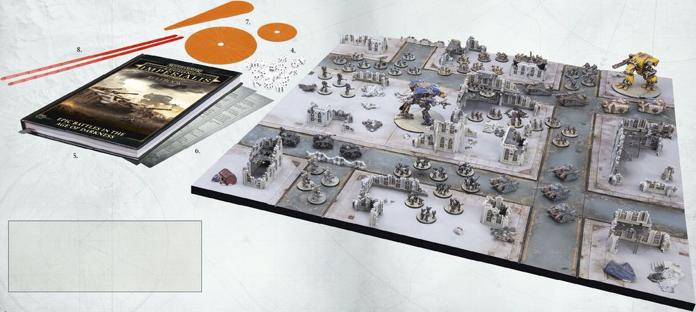

# PLAYING LEGIONS IMPERIALIS

Shown here is an example of a game of Legions Imperialis in full swing, as Loyalist and Traitor forces clash over a ruined city, giving you an idea of how a game is set up.

&emsp;1. **The Battlefield**

Any flat area can become a suitable battlefield with the addition of some terrain. Typically, a game of Legions Imperialis is fought on a 5' x 4' battlefield, however smaller games can be fought on smaller tables.

&emsp;2. **Terrain**

Games of Legions Imperialis are improved by the inclusion of terrain, such as the modular Manufactorum Imperialis, and Civitas Imperialis buildings and ruins sets. A variety of rules are included within the Terrain section of this book ([see page 66](./legions_imperialis_rules/terrain/)) that allow players to use a wide variety of different terrain pieces on the battlefield. 

&emsp;3. **Models**

Models are the core of Legions Imperialis, representing the armies that fought during the Horus Heresy. Each player will need a set of miniatures to represent their armies on the battlefield. The addition of more models increases the size and scope of the battles, with the average Legions Imperialis game seeing 2,500-3,000 points per player - [see page 126](./legions_imperialis_rules/mustering_an_army/) for more details.

&emsp;4. **Dice**

Legions Imperialis uses dice, primarily D6, to resolve most aspects of the game - [see page 33](./legions_imperialis_rules/core_principles/#dice-and-dice-rolls) for more details.

&emsp;5. **Rulebook**

The book in your hands. Within, you'll find all the rules you need to play a game of Legions Imperialis, including the core rules ([see page 32](./legions_imperialis_rules/core_principles/)) , Missions ([see page 104](./legions_imperialis_rules/missions/)) and Army Lists and datasheets ([see page 126](./legions_imperialis_rules/mustering_an_army/)).

&emsp;6. **Reference Sheets**

A reference sheet which allows players to easily look up the most commonly used rules and tables for Legions Imperialis mid-game.

&emsp;7. **Blast and Flame Templates**

These templates represent massive explosions, energy blasts and gouts of flame, and are used with weapons that have certain Traits - [see page 77](./legions_imperialis_rules/weapon_traits/) for more details.

&emsp;8. **Range Ruler**

At various points, players will be called upon to measure distances, such as when moving a model or measuring the range of a weapon. A Range Ruler is a handy tool for doing that, though players can use any measuring tool they wish, such as a tape measure.

---

*Legions Imperialis takes place during the Horus Heresy, where the Imperium of Mankind was plunged into civil war by the actions of Horus Lupercal, favoured son of the Emperor. Games of Legions Imperialis are epic confrontations, fought between vast armies ranging from the line troops of the Legiones Astartes to the towering god-engines of the Collegia Titanica. Each player will assemble their own armies of detailed Citadel miniatures and take to the battlefield for glory and for victory.*