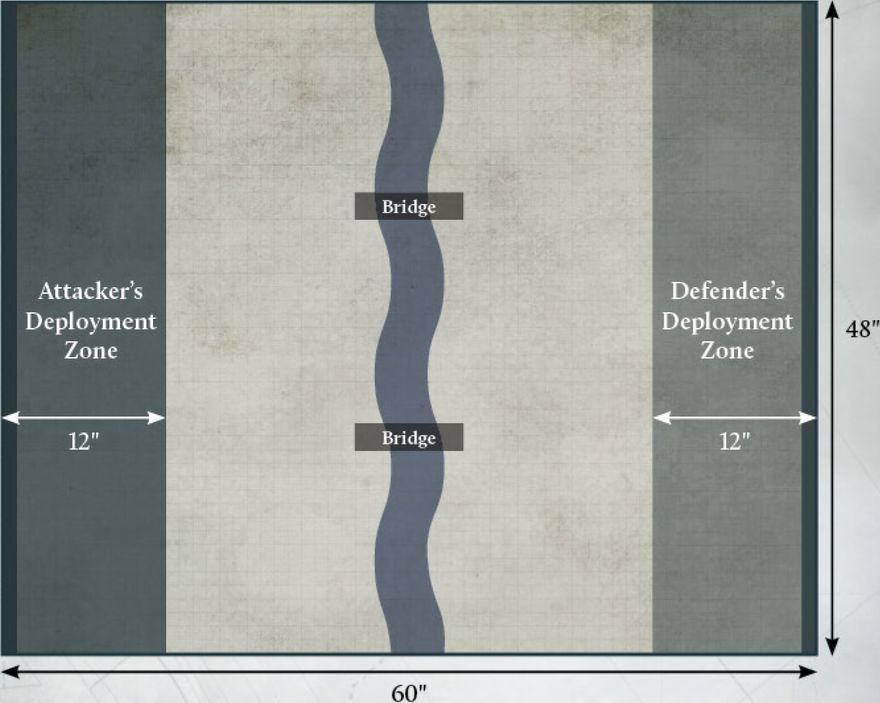
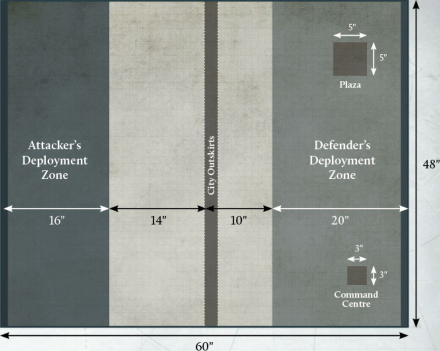
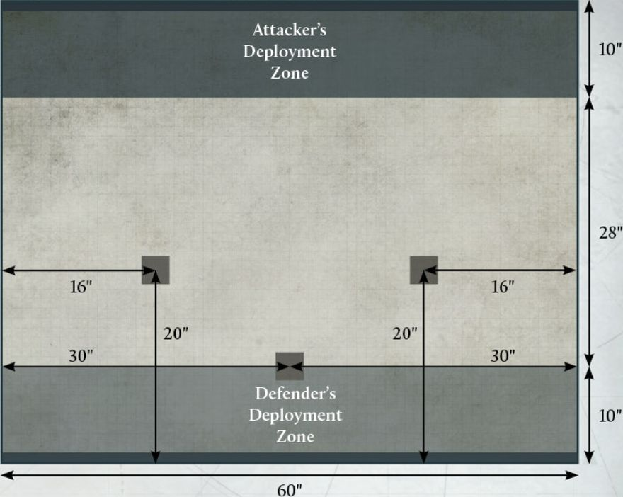

## FLASHPOINT - RIVER CROSSING

**Mission Specifics**

In this Mission, the two armies are vying for control over a vital crossing over a river or other natural obstacle.

Two bridges span the river, with the objective being to capture these crossings and push onwards into enemy territory.

Players determine a Secondary Objective as normal.

**The River**

When terrain is being deployed a River should be placed, starting from the centre of one long battlefield edge and finishing within 3" of the centre of the opposite long battlefield edge. Players then take it in turns, starting with the player who is part of the Faction with the most Campaign Points, to place a bridge somewhere along the river until there are two bridges. The bridges must be at least 12" apart.

**Scoring**

At the end of the battle, players must calculate who controls each bridge. For each bridge, calculate the Tactical Strength of each player's models that are within 3" of the bridge. The player with the highest Tactical Strength controls the bridge; if it is a tie, neither player controls it.

At the end of the battle, you score:

- 10 Victory Points for each bridge you control.

- 15 Victory Points if the total Tactical Strength of your models in the opponent's deployment zone is two or more times greater than the total Tactical Strength of your opponent's models in their deployment zone.

**Flashpoint Boon**

During the Grand Clash, each player from the Faction that was victorious during this Cycle may choose a Formation they control. All units in that Formation gain the [Forward Deployment] special rule.

---

## FLASHPOINT - ASSAULT THE CITY

**Mission Specifics**

In this Mission, the Attacker is attempting to gain a foothold in the Defender's city. The Defender must deploy their Detachments within the Defender's deployment zone (with the exception of any in Reserves). The Attacker must then deploy their Detachments within the Attacker's deployment zone.

Instead of determining Secondary Objectives as normal:

- The Attacker automatically has the Plant the Standard Secondary Objective.

- The Defender automatically has the Control the Battlefield Secondary Objective.

**Key Locations**

Instead of regular Objective Markers, there are three specific Objective Locations within the Defender's deployment zone.

- **City Outskirts:** The City Outskirts is an area of the battlefield representing the edge of the city, 3" in width and running from long table edge to long table edge.

- **Plaza:** The Plaza is a 5"x5" area on the battlefield that is clear of all Structures and may include a minimal amount of other areas of terrain.

- **Command Centre:** The Command Centre is a Structure that must cover an area of at least 3"x3". The Command Centre cannot be destroyed.

The Plaza and the Command Centre are deployed by the Defender before any other terrain is deployed. They must be at least 6" away from any battlefield edge and at least 15" away from one another.

**Scoring**

At the end of the battle, players must determine who controls which Objective. You score:

- 6 VPs if you control the  City Outskirts.

- 10 VPs if you control the Plaza.

- 15 VPs if you control the Command Centre.

You control the City Outskirts if the total Tactical Strength of your models within it is two or more times greater than the total Tactical Strength of your opponent's models within the City Outskirts.

You control the Plaza if the total Tactical Strength of your models within it is two or more times greater than the total Tactical Strength of your opponent's models within the Plaza.

You control the Command Centre if you have one or more Detachments garrisoned within it. If neither player has a Detachment garrisoned within it, then the Command Centre is treated as an Objective marker the size of its area, and the Tactical Strength of all models within 3" of it is used to calculate who is in control as normal.

**Flashpoint Boon**

During the Grand Clash, each player from the Faction that was victorious during this Cycle gains an additional 250 Requisition Points. This can take them over the normal Requisition Point limit.

In addition, Requisition Points are added to the total points cost allowed for Allied Contingents, i.e., each player will have 30% of their points limit plus the total amount of Requisition Points.

---

## FLASHPOINT - DEPOT RAID**

**Mission Specifics**

In this Mission, the Attacker is attempting to plunder supplies from the Defender's munition depots.

The Defender must deploy their Detachments within the Defender's deployment zone (with the exception of any in Reserves). The Attacker must then deploy their Detachments within the Attacker's deployment zone.

Instead of determining Secondary Objectives as normal:

- The Attacker automatically has the Carnage Secondary Objective.

- The Defender automatically has the Vital Intel Secondary Objective.

**Munition Depot**

There are three Munition Depots on the battlefield, deployed as shown on the deployment map. Each Depot is an Objective marker represented by an area of Impassable Terrain 3"x3" in size. Munition Depots are captured like normal Objective markers, with the Tactical Strength of any model within 3" of a Depot used to determine who has control of it.

During the Calculate Victory Points stage of the End phase, if a Depot was controlled by the Defender at the start of the turn and they retain control of it, the Defender may detonate the Depot. They gain no Victory Points from the Depot in that turn and the Depot is destroyed and removed from the battlefield. Every model, friend or foe, within 5" of a Depot must make a Save roll at -1 AP, bypassing Void Shields; if they fail, they suffer a Wound.

At the end of the battle, the Defender loses 10 VPs for each Depot that is destroyed.

**Scoring**

At the end of each round, you score:

• 5 VPs for each Munition Depot you control.

**Flashpoint Boon**

During the Grand Clash, the Faction that was victorious during this Cycle gains access to an Artillery Bombardment. At the start of each Combat phase, before any activations are resolved, the Faction General may fire a bombardment using the profile below, measuring from any point on the Faction's battlefield edge:

| Weapon               | Range | Dice | To Hit | AP  | Traits         |
|-----------------------|-------|------|--------|-----|----------------|
| Artillery bombardment | 200"  | 2    | 4+     | -2  | Heavy Barrage  |

