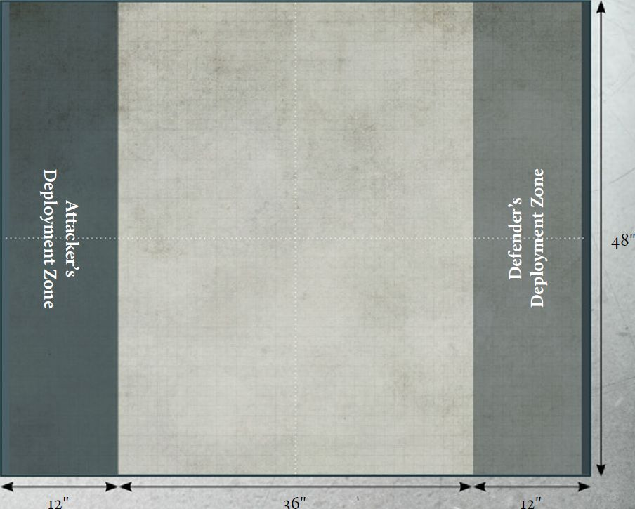
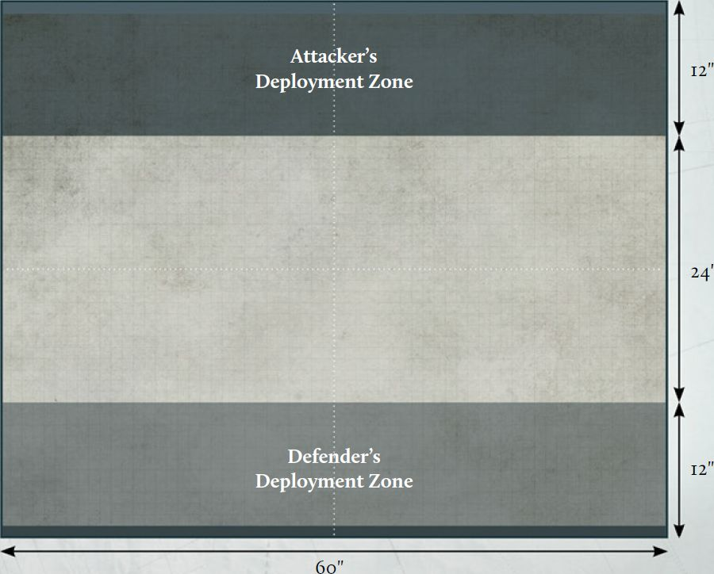
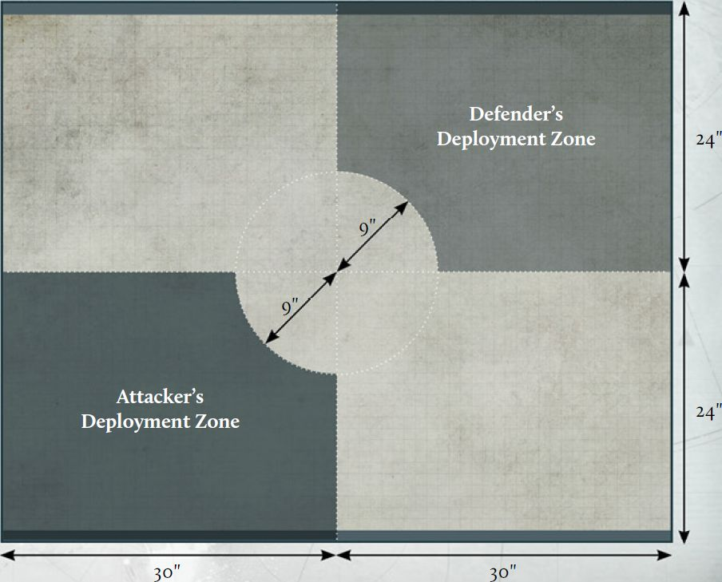

The following pages list the Spearhead Assault Missions.

Each Mission comprises a deployment map and the conditions for winning a battle.

}After terrain has been set up, the player who wins control of the battlefield chooses a deployment zone. Deployment zones are indicated on each Mission's deployment map, represented by different colours for each zone. In the majority of Missions presented here, a player's battlefield edge is the long table edge which is touching the player's deployment zone - where this is not the case, the battlefield edge of each player will be highlighted in a corresponding colour. Any Objective markers that need to be deployed are represented by black dots. Some Missions will have additional rules for deployment or special rules that are active during the battle. These will be listed in the Mission's description.

## ARMOURED ENGAGEMENT

***Scoring***

**Seek and Eliminate:**

At the end of each round, the player who destroyed the most Detachments from their opponent's Army during that round scores 3 VPs.

**Armoured Breakthrough:**

At the end of the battle, each player scores a number of VPs for each Detachment from their Army that is wholly within their opponent's deployment zone, equal to the Scale of that Detachment.

---

## SWEEPING FRONT

***Scoring***

**Seek and Eliminate:**

At the end of each round, the player who destroyed the most Detachments from their opponent's Army during that round scores 3 VPs. If any of these Detachments were wholly within that player's deployment zone, they score 1 additional VP.

**Armoured Breakthrough:**

At the end of the battle, each player scores a number of VPs for each Detachment from their Army that is wholly within their opponent's deployment zone, equal to the Scale of that Detachment.

---

## CLASH OF COLUMNS

***Scoring***

**Seek and Eliminate:**

At the end of each round, the player who destroyed the most Detachments from their opponent's Army during that round scores 3 VPs. If any of these Detachments were wholly within that player's deployment zone, they score 1 additional VP.

**Armoured Breakthrough:**

At the end of the battle, each player scores a number of VPs for each Detachment from their Army that is wholly within their opponent's deployment zone, equal to the Scale of that Detachment.

---

## SECONDARY OBJECTIVES

In addition to the possible ways to score Victory Points described in each Mission, each player has a Secondary Objective. Secondary Objectives are chosen as described on [page 74].

Each of the Secondary Objectives are described over the following pages. If a Secondary Objective requires the placement of an Objective marker, then the marker must be clearly indicated as different from the Mission Objective markers. Any time a Secondary Objective marker is placed, either while setting up the battlefield or during the course of a game, it cannot be placed within an area of Impassable Terrain, overlapping a Structure or overlapping the base of any model. If the marker must be placed but does not meet these rules, move the marker the shortest possible distance to allow it to be placed.

Objective markers placed as part of a Secondary Objective do not score VPs due to the Mission rules - they are used solely for the Secondary Objective.

However, players should still determine who is in control of each marker during the End phase of each round.

### Armoured Dominance

At the end of the battle, calculate the total points value of enemy Detachments with a Scale of 2 or higher that have been destroyed. Detachments that have lost half or more of their starting models count as half their total points value (rounding down to the nearest whole number).

The player with this Secondary Objective scores VPs depending on the percentage of enemy Detachments with a Scale of 2 or higher that have been destroyed relative to the total points cost of Detachments with a Scale of 2 or higher in the enemy Army, as follows:

* If at least 35% has been destroyed, the controlling player scores 5 VPs. 
* If at least 65% has been destroyed, the controlling player scores 10 VPs instead. 
* If at least 80% has been destroyed, the controlling player scores 15 VPs instead

### Rescue

At the start of the first round, before any Order tokens are placed, the opponent of the player with this Secondary Objective deploys an Objective marker as close as possible to the centre of the battlefield. This represents the personnel that must be rescued. The marker cannot be deployed within an area of Impassable terrain or overlapping a Structure.

If a Detachment with a Scale of 2 or 3 controlled by the player with this Secondary Objective ends its activation in the Movement phase within 1" of the Objective marker and more than 1" from any enemy models, it may rescue the personnel - remove the marker from the battlefield. That Detachment is considered to be carrying the personnel. Models with the Flyer, Skimmer and Hover special rules cannot rescue the personnel, though models from the Detachment carrying it can subsequently Embark upon a Transport with these special rules.

If the Detachment carrying the marker is destroyed, the opposing player places the Objective marker back on the battlefield in the centre of where the final model from that Detachment was. If the Detachment carrying the marker is destroyed due to an Overwatch being called, the opposing player places the marker within 3" of the destroyed model's starting position (i.e., before it began moving).

During the Calculating Victory Points stage of the End phase of any round, a Detachment carrying the marker, or a Transport the Detachment is Embarked upon, that is within 1" of their battlefield edge can deliver the personnel to safety - remove that Detachment from the battlefield. This can only be done if the Detachment is in Coherency. The removed Detachment, and any Transports it was Embarked upon, does not count as destroyed but plays no further part in the battle.

If a model carrying the marker leaves the battlefield for any other reason (e.g., due to fleeing), place the marker touching the battlefield edge at the point where the Detachment left the battlefield.

If a model carrying the marker is Embarked upon a Transport with the Flyer special rule and that Transport leaves the battlefield, it also counts as having delivered the personnel to safety; both the Detachment carrying the marker and the Transport play no further part in the battle.

**Scoring**

At the end of the battle, the player with this Secondary Objective scores 15 VPs if the personnel have been delivered to safety, 10 VPs if the personnel have not been delivered to safety but are being carried by a friendly Detachment or 5 VPs if the personnel marker is on the battlefield and no enemy models are within 8" of it.

### Dominate the Battlefield

At the end of the battle, divide the battlefield into equal quarters and calculate the total Tactical Strength (see page 103 of the *Legions Imperialis Rulebook*) of each player's models with a Scale of 2 or more that are wholly within each quarter. The player with the greatest total Tactical Strength in each quarter is said to be in control of it - if the total Tactical Strength is the same, no player controls it.

**Scoring**

At the end of the battle, the player with this Secondary Objective scores 5 VPs if they control at least one battlefield quarter, 10 VPs if they control at least two battlefield quarters and 15 VPs if they control three or more battlefield quarters.

### Tip of the Spear

At the start of the first round, before any Order tokens are placed, the player with this Secondary Objective secretly notes down up to five Detachments from their Army with a Scale of 2 or 3 to be Spearhead Detachments. Models with the Flyer special rule cannot be chosen, nor can models Embarked upon a Transport with the Flyer special rule, and a Spearhead Detachment cannot Embark upon a Transport at any point during the battle. The first time a Spearhead Detachment destroys an enemy Detachment, that Spearhead Detachment becomes eligible to break through.

During the Calculating Victory Points stage of the End phase of any round, any Spearhead Detachment from your Army that is within 1" of the enemy battlefield edge, is not Engaged and Pinned, and is eligible to break through can be removed from the battlefield. The removed Detachment does not count as destroyed but plays no further part in the battle, and is said to have Broken Through.

**Scoring**

At the end of the battle, the player with this Secondary Objective scores 5 VPs if one friendly Spearhead Detachment has Broken Through, 10 VPs if two friendly Spearhead Detachments have Broken Through and 15 VPs if three or more friendly Spearhead Detachments have Broken Through.

### Glory Kill

At the start of the first round, before any Order tokens are placed, the player with this Secondary Objective determines the five Detachments on the battlefield from their opponent's Army with the highest Scale to be Prime Targets. If several Detachments have the same Scale, the Detachments with the highest number of models are Prime Targets. If there is a tie for the number of models between one or more eligible Detachments, the player with this Secondary Objective can select which are Prime Targets.

*Example: Ben's opponent has a Warlord Battle Titan, which has the highest Scale in their Army. They do not have any other Detachments of Scale 5 or4, but have six Detachments with a Scale of3. Two of these have three models and the others have two models. As such, the Warlord Titan and the two Detachments which include three models are automatically Prime Targets. Ben can then select two of the units that include two models to also be Prime Targets.*

**Scoring**

At the end of the battle, the player with this Secondary Objective scores 3 VPs for each Prime Target Detachment that has been destroyed.

### Inviolable

The player with this Secondary Objective must prevent enemy Detachments from getting close to their battlefield edge.

**Scoring**

At the end of the battle, the player with this Secondary

Objective scores 5 VPs for each of the following that applies:

* There are no enemy models with a Scale of 2 or more within 6" of their battlefield edge.
* There are no enemy models with a Scale of 2 or more within 12" of their battlefield edge.
* There are no enemy models with a Scale of 2 or more within 18" of their battlefield edge.
