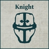

## Legion Support

The god-engines of the Collegia Titanica were terrifying weapons of war, each one capable of obliterating hordes of lesser enemies. Though it was not unheard of for a Titan Legion to be fielded in large numbers, it was more common for a small number of god-engines to be attached to other Imperial forces, lending their considerable might for the duration of a campaign.

**COMPULSORY DETACHMENTS**

## Knight Household Lance

Knight Scions would frequently march to battle in Lances, consisting of a group of Knight armours of the same class commanded by a Scion of middling rank. These units would act as support elements for Titan maniples or other Imperial elements, utilising the skill of their Scions and the wondrous artifice of each Knight to ensure victory.

**Paragon of Duty:** Each Knight Scion is a master of battle, trained in the tactics of their Household. As such, each Knight model within this Formation that has the Independent special rule always forms its own Independent Unit, even if there are several models within a Detachment that have the same name.

*For example: A Questoris Knight Banner consists of a Knight Errant, 2 Knight Paladin and 1 Questoris Knight Armiger Talon. As such the Detachment is formed of three Independent Units: a Knight Errant, a Knight Paladin and a Knight Paladin.* 

In some cases, this will mean the entire Detachment is formed of Independent Units - they still count as a single Detachment, and so must maintain a Coherency of 6" with at least one other model in the Detachment, but otherwise can be issued an Order separately, have some models Engaged and not others, etc.

**COMPULSORY DETACHMENTS**

